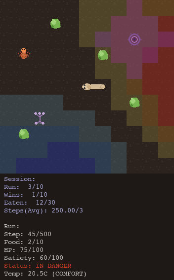

# 🪱 Quantum Nematode

[](https://github.com/SyntheticBrains/nematode/actions/workflows/pre-commit.yml)
[](https://github.com/SyntheticBrains/nematode/actions/workflows/tests.yml)
[](https://github.com/SyntheticBrains/nematode/actions/workflows/nightly-tests.yml)
[](https://codecov.io/gh/SyntheticBrains/nematode)

<p align="center">
  
</p>

This project simulates a simplified nematode (C. elegans) navigating dynamic foraging environments to find food while managing satiety, using either a **quantum variational circuit** or a **classical neural network** as its decision-making brain. It leverages [Qiskit](https://qiskit.org) to simulate quantum behavior and integrates classical logic for realistic foraging dynamics.

## 🧪 Features

- ✅ **Dynamic Foraging Environment**: Realistic multi-food foraging with satiety management and distance efficiency tracking
- ✅ **Predator Evasion**: Multi-objective learning with random-moving predators and gradient-based danger perception
- ✅ **Modular Quantum Brain**: Parameterized quantum circuits with 2+ qubits for decision-making
- ✅ **Classical ML Alternatives**: REINFORCE, PPO, DQN, and spiking neural network brain architectures
- ✅ **Quantum Learning**: Parameter-shift rule for gradient-based optimization
- ✅ **Hardware Support**: Classical simulation (AerSimulator) and real quantum hardware (IBM QPU)
- ✅ **Comprehensive Tracking**: Per-run and session-level metrics, plots, and CSV exports
- ✅ **Interactive Workflows**: CLI scripts with flexible configuration
- 🚧 **Expandable Framework**: Modular design for research and experimentation

## 🧠 Brain Architectures

Choose from 12 brain architectures spanning quantum, classical, hybrid, and biologically-inspired approaches:

**Quantum:**

- **QVarCircuitBrain** (qvarcircuit): Quantum variational circuit with modular sensory processing and parameter-shift rule gradients
- **QRCBrain** (qrc): Quantum reservoir computing with data re-uploading circuits and classical readout
- **QSNNReinforceBrain** (qsnnreinforce): Quantum spiking neural network (QLIF neurons) with surrogate gradient REINFORCE
- **QSNNPPOBrain** (qsnnppo): QLIF quantum spiking network with PPO training (experimental — architecturally incompatible)
- **QQLearningBrain** (qqlearning): Hybrid quantum-classical Q-learning with experience replay

**Hybrid (Quantum + Classical):**

- **HybridQuantumBrain** (hybridquantum): QSNN reflex + classical cortex MLP + classical critic with mode-gated fusion and 3-stage curriculum (96.9% on pursuit predators)
- **HybridClassicalBrain** (hybridclassical): Classical ablation control for HybridQuantum — replaces QSNN reflex with small classical MLP (96.3% on pursuit predators)
- **HybridQuantumCortexBrain** (hybridquantumcortex): QSNN reflex + QSNN cortex (grouped sensory QLIF) + classical critic with 4-stage curriculum (halted — 40.9% on 2-predator)

**Classical:**

- **MLPPPOBrain** (mlpppo): Classical actor-critic with Proximal Policy Optimization (clipped objective, GAE)
- **MLPReinforceBrain** (mlpreinforce): Classical multi-layer perceptron with policy gradients (REINFORCE)
- **MLPDQNBrain** (mlpdqn): Classical MLP with Deep Q-Network (DQN) learning

**Biologically-Inspired:**

- **SpikingReinforceBrain** (spikingreinforce): Biologically realistic spiking neural network with LIF neurons and surrogate gradient learning

Select the brain architecture when running simulations:

```bash
python scripts/run_simulation.py --brain hybridquantum     # Best quantum (96.9% pursuit predators)
python scripts/run_simulation.py --brain mlpppo            # Best classical (PPO actor-critic)
python scripts/run_simulation.py --brain spikingreinforce  # Biologically realistic (LIF spiking)
python scripts/run_simulation.py --brain qvarcircuit       # Quantum variational circuit
```

## 🚀 Quick Start

### 1. Install Dependencies

Install [uv](https://github.com/astral-sh/uv) for dependency management:

```bash
brew install uv
```

Install the project (choose one based on your needs):

```bash
# For CPU simulation (recommended for beginners)
uv sync --extra cpu --extra pixel --extra torch

# For quantum hardware access (requires IBM Quantum account)
uv sync --extra qpu --extra pixel

# For GPU acceleration (local installation)
uv sync --extra gpu --extra pixel --extra torch

# For GPU acceleration (Docker with NVIDIA GPU support)
docker compose up --build
```

> **Docker GPU Requirements**: For the Docker setup, you need Docker with NVIDIA Container Toolkit installed for GPU acceleration.

### 2. Configure Environment (Optional)

If using quantum hardware, set up your IBM Quantum API key:

```bash
cp .env.template .env
# Edit .env to add your IBM_QUANTUM_API_KEY
```

### 3. Run a Simulation

**Command Line Examples:**

```bash
# Hybrid quantum brain — QSNN reflex + classical cortex (best quantum: 96.9% on pursuit predators)
uv run ./scripts/run_simulation.py --log-level DEBUG --show-last-frame-only --track-per-run --runs 50 --config ./configs/examples/hybridquantum_foraging_small.yml --theme emoji

# Classical PPO brain (best classical: actor-critic with GAE)
uv run ./scripts/run_simulation.py --log-level DEBUG --show-last-frame-only --track-per-run --runs 50 --config ./configs/examples/mlpppo_foraging_medium.yml --theme emoji

# Spiking neural network brain (biologically realistic LIF neurons)
uv run ./scripts/run_simulation.py --log-level DEBUG --show-last-frame-only --track-per-run --runs 50 --config ./configs/examples/spikingreinforce_foraging_small.yml --theme emoji

# Quantum variational circuit brain
uv run ./scripts/run_simulation.py --log-level DEBUG --show-last-frame-only --track-per-run --runs 50 --config ./configs/examples/qvarcircuit_foraging_medium.yml --theme emoji

# Quantum hardware (IBM QPU) with dynamic foraging
uv run ./scripts/run_simulation.py --log-level DEBUG --show-last-frame-only --track-per-run --runs 1 --config ./configs/examples/qvarcircuit_foraging_small.yml --theme emoji --device qpu
```

**Docker GPU Examples:**

```bash
# Run dynamic foraging with MLP brain and GPU acceleration
docker-compose exec quantum-nematode uv run ./scripts/run_simulation.py --log-level DEBUG --show-last-frame-only --track-per-run --runs 50 --config ./configs/examples/mlpreinforce_foraging_medium.yml --theme emoji

# Interactive Docker shell for development
docker-compose exec quantum-nematode bash
```

## ❓ How It Works

### Dynamic Foraging Environment

1. **State Perception**: The nematode perceives its environment through a viewport (distance to nearest food, gradient information, satiety level)
2. **Brain Processing**: The selected brain architecture processes the state
3. **Action Selection**: Brain outputs action probabilities (forward, left, right, stay)
4. **Environment Update**: Agent moves, satiety decays, and receives reward signal
5. **Food Collection**: When reaching food, satiety is restored and new food spawns
6. **Learning**: Brain parameters are updated based on reward feedback
7. **Repeat**: Process continues until all foods are collected, satiety reaches zero (starvation), or maximum steps reached

### Quantum Learning Process

The project supports multiple quantum learning approaches:

- **Quantum Feature Encoding**: Environmental data encoded as qubit rotations
- **Parameterized Quantum Circuits**: Trainable quantum gates for decision-making
- **Surrogate Gradient Descent**: Differentiable QLIF (Quantum LIF) neurons enabling backpropagation through quantum spiking layers — used by the highest-performing hybrid architectures
- **Parameter-Shift Rule**: Analytical quantum gradient computation for variational circuits
- **Evolutionary Optimization**: CMA-ES and genetic algorithms as gradient-free alternatives
- **Entanglement**: Quantum correlations between different sensory modules

### Spiking Neural Network

The spiking brain architecture provides biologically realistic neural computation with modern gradient-based learning:

- **Leaky Integrate-and-Fire (LIF) Neurons**: Membrane potential dynamics with spike generation
- **Surrogate Gradient Descent**: Differentiable spike approximation enabling backpropagation
- **Policy Gradient Learning (REINFORCE)**: Same proven algorithm as MLPBrain
- **Population Coding**: Gaussian tuning curves for improved input discrimination

**Key Features:**

- Biologically plausible temporal dynamics with LIF neurons
- Effective gradient-based learning through surrogate gradients
- Configurable network architecture (timesteps, hidden layers, hidden size)
- Achieves 100% success on foraging tasks, 63% on predator evasion

### Predator Evasion

The predator evasion system adds a challenging multi-objective learning task where agents must balance food collection with survival:

**Predator Mechanics:**

- Random movement patterns with configurable speed (default 1 unit/step)
- Detection radius (default 8 units) creating danger zones
- Kill radius (default 0 units) for lethal collisions
- Multiple predators with independent movement

**Gradient-Based Perception:**

- **Food gradients**: Attractive exponential decay guiding agents toward food
- **Predator gradients**: Repulsive exponential decay warning of danger
- **Gradient superposition**: Combined vector field for multi-objective decision-making
- Agent perceives both food and threat locations through unified gradient system

**Learning Dynamics:**

- **Proximity penalty**: Continuous negative reward when in danger zone (detection radius)
- **Death penalty**: Large negative reward (default -10.0) on predator collision
- **Multi-objective optimization**: Agents learn to collect food while avoiding threats
- **Predator metrics**: Track encounters, successful evasions, and survival strategies

## 🏆 Top Benchmarks

Track and compare performance across different brain architectures and optimization strategies. The benchmark system helps identify effective approaches and advances the state-of-the-art in quantum navigation.

### Quick Start with Benchmarks

```bash
# Run 10+ independent training sessions
for session in {1..10}; do
    uv run scripts/run_simulation.py \
        --config configs/your_config.yml \
        --track-experiment \
        --runs 50
done

# Submit all sessions together
uv run scripts/benchmark_submit.py \
    --experiments experiments/* \
    --category foraging_small/classical \
    --contributor "Your Name"

# Regenerate leaderboards
uv run scripts/benchmark_submit.py regenerate
```

### Current Leaders

#### Foraging Small - Classical

| Brain | Score | Success Rate | Learning Speed | Stability | Distance Efficiency | Sessions | Contributor | Date |
|---|---|---|---|---|---|---|---|---|
| mlpppo | 0.835 ± 0.007 | 96.7% ± 1.3% | 0.93 ± 0.01 | 0.95 ± 0.05 | 0.47 ± 0.02 | 12 | @chrisjz | 2025-12-28 |
| mlpreinforce | 0.810 ± 0.014 | 95.1% ± 1.9% | 0.91 ± 0.02 | 0.99 ± 0.03 | 0.39 ± 0.04 | 12 | @chrisjz | 2025-12-29 |

#### Foraging Small - Quantum

| Brain | Score | Success Rate | Learning Speed | Stability | Distance Efficiency | Sessions | Contributor | Date |
|---|---|---|---|---|---|---|---|---|
| qvarcircuit | 0.835 ± 0.006 | 99.8% ± 0.6% | 0.80 ± 0.00 | 0.99 ± 0.04 | 0.46 ± 0.01 | 12 | @chrisjz | 2025-12-29 |

#### Predator Small - Classical

| Brain | Score | Success Rate | Learning Speed | Stability | Distance Efficiency | Sessions | Contributor | Date |
|---|---|---|---|---|---|---|---|---|
| mlpppo | 0.728 ± 0.029 | 83.3% ± 2.9% | 0.92 ± 0.02 | 0.62 ± 0.05 | 0.51 ± 0.02 | 12 | @chrisjz | 2025-12-29 |
| mlpreinforce | 0.624 ± 0.123 | 73.4% ± 10.9% | 0.84 ± 0.09 | 0.52 ± 0.19 | 0.39 ± 0.07 | 12 | @chrisjz | 2025-12-29 |

#### Predator Small - Quantum

| Brain | Score | Success Rate | Learning Speed | Stability | Distance Efficiency | Sessions | Contributor | Date |
|---|---|---|---|---|---|---|---|---|
| qvarcircuit | 0.611 ± 0.054 | 76.1% ± 2.1% | 0.93 ± 0.04 | 0.47 ± 0.04 | 0.45 ± 0.01 | 12 | @chrisjz | 2025-12-29 |

See [BENCHMARKS.md](BENCHMARKS.md) for complete leaderboards and submission guidelines.

## 📊 Simulation Visualization

The default Pixel theme renders the simulation in a Pygame window with biologically accurate sprites inspired by real *C. elegans* ecology:



### Entities

| Entity | Visual | Biological Basis |
|--------|--------|-----------------|
| **Nematode head** | Translucent rounded head with pharynx bulb, directional facing | *C. elegans* head morphology |
| **Nematode body** | Connected tan/cream segments with tapered tail | *C. elegans* body coloring |
| **Food** | Green clustered dots | *E. coli* / OP50 bacterial lawns |
| **Random predator** | Purple branching tendrils | Nematode-trapping fungi (*Arthrobotrys oligospora*) |
| **Stationary predator** | Purple ring/net structure with toxic zone | Constricting ring traps (*Drechslerella*) |
| **Pursuit predator** | Orange-red arachnid shape | Predatory mites |

### Environment Layers

| Layer | Description |
|-------|-------------|
| **Soil** | Dark earth background with subtle texture |
| **Temperature zones** | Blue (cold) through neutral to red/orange (hot) overlays based on thermal gradient |
| **Toxic zones** | Purple overlay around stationary predators indicating damage radius |

### Status Bar

The status bar displays session-level information (run progress, cumulative wins, total food eaten, average steps) and run-level information (current step, food collected, health, satiety, danger status, temperature zone).

### Alternative Themes

Console-based themes (ASCII, Emoji, Rich, etc.) are also available for headless or CI environments. Set `--theme` when running the simulation to switch between them.

### Session Summary

After all runs complete, a summary report is printed to the console:

```text
Total runs completed: 50
Successful runs: 30 (60.0%)
Failed runs - Starved: 2 (4.0%)
Failed runs - Health Depleted: 15 (30.0%)
Failed runs - Max Steps: 3 (6.0%)
Average foods collected per run: 8.18
Average steps per run: 300.20
Average reward per run: 1.93
Average distance efficiency: 0.32
Average survival score: 0.72
Average temperature comfort: 0.68
Success rate: 60.00%
```

## 🧰 Built With

- **[Qiskit](https://qiskit.org/)**: Quantum computing framework
- **[PyTorch](https://pytorch.org/)**: Classical neural networks
- **[uv](https://github.com/astral-sh/uv)**: Modern Python dependency management
- **[Pydantic](https://pydantic.dev/)**: Data validation and settings
- **[Rich](https://rich.readthedocs.io/)**: Beautiful terminal output

## 🔬 Research Applications

This project serves as a platform for exploring:

- **Quantum Machine Learning**: Investigating quantum advantages in learning tasks
- **Biological Modeling**: Simplified models of neural decision-making
- **Hybrid Algorithms**: Combining quantum and classical computation
- **NISQ Applications**: Near-term quantum computing applications

## 🗺️ Roadmap

See [docs/roadmap.md](docs/roadmap.md) for the comprehensive project roadmap.

### Upcoming Features

- **SOTA RL Baselines**: Modern algorithms (SAC, TD3) for credible classical comparison
- **Enhanced Sensory Systems**: Thermotaxis, oxygen sensing, mechanosensation (touch response), and health/damage systems
- **Advanced Predator Behaviors**: Stationary traps, pursuit patterns, patrol routes, and group hunting strategies
- **Architecture Analysis**: Ablation studies, interpretability tools, and systematic feature importance ranking
- **Learning & Memory**: Associative learning systems (STAM, ITAM, LTAM) with biological timescales
- **Evolution & Breeding**: Genetic algorithms, Baldwin effect, co-evolution of predators and prey
- **Multi-Agent Scenarios**: Cooperative and competitive foraging with pheromone communication and emergent behaviors
- **Advanced Quantum Algorithms**: VQE, QAOA, quantum error mitigation, and hardware deployment
- **Real-World Validation**: WormBot deployment, C. elegans lab collaborations, cross-organism transfer (Drosophila, zebrafish)

### Research Applications

This platform enables research in:

- Quantum advantages in reinforcement learning and biologically-relevant navigation tasks
- Bio-inspired quantum algorithms for multi-objective decision-making
- Comparative analysis of quantum, classical, and spiking neural architectures
- Hybrid quantum-classical computation in ecologically-valid environments
- Near-term quantum device applications (NISQ algorithms with error mitigation)
- Theoretical foundations linking quantum mechanics to biological neural computation
- Universal computational principles transferable across organisms (C. elegans → Drosophila → zebrafish) and domains (foraging → robotics)

## 🤝 Contributing

We welcome contributions! Please see our [Contributing Guide](CONTRIBUTING.md) for complete development setup instructions, code style guidelines, testing procedures, and pull request process.

### Areas We Need Help With

- **Quantum Algorithm Development**: New quantum learning techniques for foraging
- **Foraging Environment Extensions**: Social behaviors, food quality, temperature gradients
- **Multi-Agent Scenarios**: Cooperative and competitive foraging dynamics
- **Visualization Tools**: Real-time learning analysis and environment rendering
- **Documentation**: Tutorials and examples for dynamic environments
- **Testing**: Performance benchmarks and foraging strategy analysis

## 📄 License

This project is licensed under the Apache License 2.0. See [LICENSE](LICENSE) for details.

## 🙏 Acknowledgments

- **[Q-CTRL](https://q-ctrl.com/)**: For providing quantum hardware access with Fire Opal performance management tools to suppress quantum hardware errors and optimize quantum circuits
- **[OpenSpec](https://github.com/Fission-AI/OpenSpec)**: For providing the OpenSpec framework for structured, spec-driven AI development
- **C. elegans Research Community**: For inspiring this computational model
- **Qiskit Team**: For providing excellent quantum computing tools
- **Quantum ML Community**: For advancing the field of quantum machine learning
