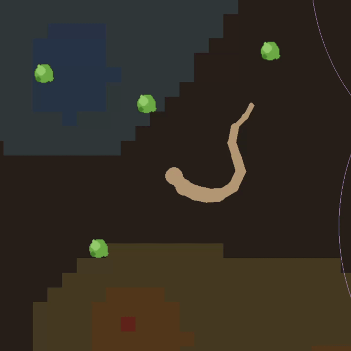
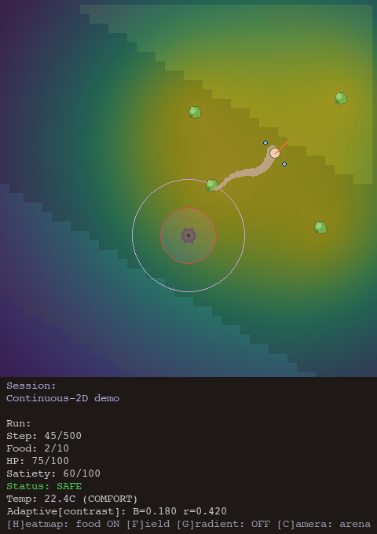
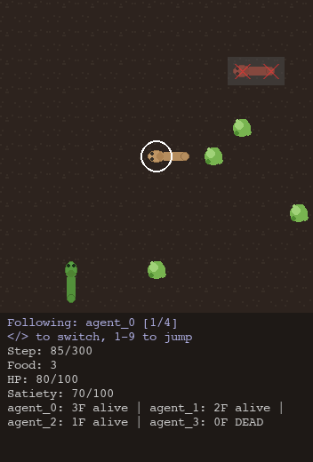

# 🪱 Quantum Nematode

[](https://github.com/SyntheticBrains/nematode/actions/workflows/tests.yml)
[](https://github.com/SyntheticBrains/nematode/actions/workflows/nightly-tests.yml)
[](https://github.com/SyntheticBrains/nematode/actions/workflows/pre-commit.yml)
[](https://codecov.io/gh/SyntheticBrains/nematode)
[](pyproject.toml)
[](LICENSE)

<p align="center">
  
</p>

**A closed-loop simulation platform for asking which brain architecture best learns a nematode's behaviours — with the real *C. elegans* connectome as the focal point of comparison.**

A simulated worm senses a continuous 2-D world — chemical gradients, temperature, oxygen, predators, other worms — a pluggable *brain* turns those senses into motor drive, and learning or evolution shapes the brain across episodes. Twenty-six brain architectures plug into the same loop: feed-forward, recurrent, liquid, attention, spiking, reservoir, quantum, hybrid, GA-evolved, and one constrained to the real 302-neuron *C. elegans* wiring diagram. Because every brain sees the same environment, reward and statistical protocol, they can be ranked on the same behaviours — and the behaviour they learn can be graded against published *C. elegans* data.

> The project started, and is still named, as a quantum-machine-learning experiment. A 300-session campaign across 11 quantum and hybrid architectures (and their variants) found no quantum advantage on these tasks under controlled attribution ([Logbook 008](docs/experiments/logbooks/008-quantum-brain-evaluation.md), [Logbook 025](docs/experiments/logbooks/025-weight-search-architecture-ranking.md)), so quantum circuits are now one architecture family in the comparison rather than the organising principle. The [roadmap](docs/roadmap.md) records that pivot and everything since.

## Results so far

Each result links to the logbook that holds the evidence. Negative results carry the same weight as positive ones.

- **Architecture ranking on the continuous substrate** ([Logbook 029](docs/experiments/logbooks/029-continuous-architecture-ranking.md)). On one integrated cell — chemotaxis foraging, predator evasion and thermotaxis all active, klinotaxis sensing, n = 8 paired seeds — the six pre-registered Phase 6 arms rank **MLP 89.0 ≫ {CfC 75.8 ≈ Transformer 74.0} > LSTM 60.1 > connectome 52.2 ≫ GA 15.0** (plateau-tail full-clear success %, three tiers separated at Benjamini–Hochberg FDR). A plain MLP wins on all three behaviours.
- **The connectome, honestly** ([Logbook 034](docs/experiments/logbooks/034-connectome-structure-controls.md), [037](docs/experiments/logbooks/037-phase6a-synthesis.md)). The wild-type *C. elegans* wiring learns the cell (8/8 seeds converge) but ranks 5th of 6 under PPO weight search — and a degree-preserving rewired-null control is statistically indistinguishable from it (52.8% vs 56.1%, q = 0.77). Under gradient-descent weight search the specific wiring confers no advantage over degree-matched alternatives: a degree-statistics result, not a wiring result, and the motivating hypothesis for Phase 7 — *is PPO simply the wrong learning rule for the connectome?*
- **Real-worm behavioural validation** ([Logbook 035](docs/experiments/logbooks/035-realworm-chemotaxis-validation.md), [036](docs/experiments/logbooks/036-realworm-thermotaxis-validation.md)). The learned worm reproduces both documented *C. elegans* chemotaxis strategies — klinokinesis (turn rate vs dC/dt; Pierce-Shimomura et al. 1999) and weathervane steering (curving rate vs bearing; Iino & Yoshida 2009; reproduced in direction, not magnitude) — on both the MLP and the connectome arms, with a sensing-ablation control that produces a double dissociation. Thermotaxis validation is partial: the weathervane is reproduced, klinokinesis is absent.
- **Working memory is resolvable but not demanded** ([Logbooks 030](docs/experiments/logbooks/030-bit-memory-positive-control.md), [032](docs/experiments/logbooks/032-ars-source-depletion.md), [033](docs/experiments/logbooks/033-associative-memory-probe.md)). On delayed-match-to-cue and associative-update probes the recurrent and attention arms separate sharply from the memoryless MLP (CfC 0.995 / Transformer 0.978 / LSTM 0.939 vs MLP 0.501; the connectome sits at chance, 0.499). A biologically-grounded area-restricted-search probe returned null: the naturalistic behaviours are reactive-dominated, which is why the memoryless MLP wins the main ranking.
- **No quantum advantage on these tasks** ([Logbook 008](docs/experiments/logbooks/008-quantum-brain-evaluation.md), [025](docs/experiments/logbooks/025-weight-search-architecture-ranking.md)). 300+ sessions across 11 quantum and hybrid architectures and their variants on the grid substrate. The best quantum architecture (HybridQuantum, 96.9% pursuit evasion) is matched by its classical ablation (96.3%); a genuinely quantum Z₂-equivariant circuit topped the grid ranking (86.0) but a matched-capacity classical-equivariant network ties it (87.9, ns).
- **Evolution and inheritance** ([Logbooks 012](docs/experiments/logbooks/012-hyperparam-evolution-mlpppo-pilot.md), [013](docs/experiments/logbooks/013-lamarckian-inheritance-pilot.md), [021](docs/experiments/logbooks/021-phase5-synthesis.md)). TPE beats CMA-ES for hyperparameter evolution; Lamarckian weight inheritance passes its pre-registered speed gate (+5.25 generations). Baldwin-effect, predator–prey co-evolution (Red Queen) and transgenerational-memory studies closed with substrate-grounded STOP verdicts, each with a diagnosis.
- **Sensing and multi-agent** ([Logbooks 009](docs/experiments/logbooks/009-temporal-sensing-evaluation.md), [010](docs/experiments/logbooks/010-aerotaxis-baselines.md), [011](docs/experiments/logbooks/011-multi-agent-evaluation.md)). Scalar-only temporal sensing with a GRU reaches oracle-level performance (94% vs 97%); derivative sensing beats oracle gradients on all six large-grid aerotaxis scenarios (+4 to +28pp); food-marking pheromones add +77pp on a single food cluster (a benefit that collapses with multiple clusters) and social feeding +47.8% food under scarcity; alarm and aggregation pheromones are inert.

## Status

- **Actively developed research software, single maintainer.** Phases 0–6a of the [roadmap](docs/roadmap.md) are complete ([Phase 6a synthesis](docs/experiments/logbooks/037-phase6a-synthesis.md)). Next is **Phase 7**: biologically-plausible plasticity (STDP and neuromodulator-gated three-factor rules) on the connectome, and cross-species transfer to *P. pacificus* using the Cook et al. 2025 connectome. Phase 6b (NEAT topology search) is deferred behind environment vectorisation.
- **Evidence discipline.** Every experiment series is a numbered [logbook](docs/experiments/README.md) with its hypothesis, method, results and decision, plus the configs, seeds and artifacts needed to reproduce it. Phase 5's pilots (Logbooks 012–018) ran n ≥ 4 seeds against pre-declared decision gates; from Logbook 019 comparisons use paired-seed Wilcoxon tests with bootstrap CIs, and the Phase 6 rankings (025 onward) add BH-FDR correction at n = 8. Earlier logbooks report session-level results. Negative results and STOP verdicts are first-class. Changes go through [OpenSpec](https://github.com/Fission-AI/OpenSpec) proposals under [`openspec/`](openspec/).
- **Engineering.** Python 3.13 only; 4,000+ tests in four tiers (unit, slow integration, CLI smoke, nightly end-to-end benchmarks); Pyright-typed and Ruff-linted (`select = ALL`). Tagged releases are on [GitHub Releases](https://github.com/SyntheticBrains/nematode/releases); internals change between them.

## Quick start

### Install

[uv](https://github.com/astral-sh/uv) manages the environment; [Git LFS](https://git-lfs.com) stores weights, checkpoints and connectome data. A fresh clone fetches only the connectome data the code needs (~4 MB); the ~620 MB of curated logbook artifacts stay as LFS pointers until you ask for them with `git lfs pull --include='artifacts/**'`.

```bash
# macOS
brew install uv git-lfs
# Linux
curl -LsSf https://astral.sh/uv/install.sh | sh && sudo apt-get install git-lfs

git lfs install
git clone https://github.com/SyntheticBrains/nematode.git
cd nematode
uv sync --extra cpu --extra torch --extra pixel
```

| Extra | What it adds |
|---|---|
| `cpu` | Qiskit Aer simulator on CPU (the default quantum backend) |
| `torch` | PyTorch — required by the classical, recurrent, spiking, hybrid and connectome brains |
| `pixel` | Pygame — the `pixel` and `pixel_continuous` renderers |
| `gpu` | Qiskit Aer on CUDA 11 (conflicts with `cpu`) |
| `qpu` | IBM Quantum runtime for real hardware (`--device qpu`; put your key in `.env`, see `.env.template`) |
| `analysis` | scikit-learn and SciPy for the analysis scripts |

### Run

```bash
# Watch an MLP-PPO worm learn klinotaxis foraging on the continuous-2D substrate
uv run ./scripts/run_simulation.py \
  --config configs/scenarios/foraging/mlpppo_small_continuous2d_fick_adaptive_klinotaxis.yml \
  --theme pixel_continuous --runs 50 --seed 1

# The same session headless (fastest): prints a summary, writes CSVs and plots to exports/<session-id>/
uv run ./scripts/run_simulation.py \
  --config configs/scenarios/foraging/mlpppo_small_continuous2d_fick_adaptive_klinotaxis.yml \
  --theme headless --runs 200 --seed 1
```

Each `--config` is a self-contained YAML scenario — the brain and its hyperparameters, the environment, the sensing mode and the reward. The 260+ scenarios under [`configs/scenarios/`](configs/README.md) are named `{brain}_{size}[_{variant}]_{sensing}.yml`.

More to try:

```bash
# The connectome-constrained brain on the three-behaviour cell used for the Phase 6 ranking
uv run ./scripts/run_simulation.py --config configs/scenarios/foraging_predator_thermal/connectomeppo_small_continuous2d_combined_klinotaxis.yml --theme headless --runs 500 --seed 1

# Five worms with social feeding and pheromones (grid substrate, Pygame)
uv run ./scripts/run_simulation.py --config configs/scenarios/multi_agent_foraging/mlpppo_medium_5agents_full_social_oracle.yml --theme pixel --runs 10

# A variational quantum circuit on the Aer simulator (add --device qpu --optimize for IBM hardware with Q-CTRL Fire Opal)
uv run ./scripts/run_simulation.py --config configs/scenarios/foraging/qvarcircuit_small_oracle.yml --theme emoji --runs 20

# Evolve a feed-forward network's weights with a genetic algorithm
uv run python scripts/run_evolution.py --config configs/evolution/feedforwardga_foraging_small.yml --algorithm ga --generations 20 --parallel 4
```

The [usage guide](docs/usage.md) covers the full CLI, experiment tracking, evolution and inheritance, the analysis scripts, quantum hardware and the GPU container.

## How it works

1. **Sense.** The worm reads its world through biologically-motivated channels: chemical concentration (oracle gradients, scalar-only temporal sensing, the temporal derivative dC/dt, or klinotaxis head-sweeps), temperature (AFD-like thermosensation), oxygen (URX/BAG-like aerotaxis), contact and distal predator cues (ASH/ALM/PVD-style mechano- and chemosensation), pheromones and neighbours in multi-agent runs, plus proprioception and a short-term associative memory (STAM) buffer. On the continuous substrate an adaptive, Weber-law chemosensor sits between the field and the brain.
2. **Decide.** The brain maps the sensory vector to motor drive. On the continuous-2D substrate that is a `(speed, turn)` command from a tanh-squashed Gaussian head; on the grid it is one of `{forward, left, right, stay}`. The environment owns the physical scale and integrates the kinematics, so the same brain works in any arena.
3. **Act and learn.** Moving costs satiety, food restores it, predators damage health, and thermal or oxygen zones range from comfortable to lethal. Reward, satiety and health feed back to the learner — PPO for most arms, REINFORCE, DQN, surrogate-gradient rules for spiking networks — or to an evolutionary outer loop: CMA-ES, genetic algorithms, TPE hyperparameter search, Lamarckian warm-starts across generations, predator–prey co-evolution.
4. **Measure.** Every run logs success, foods, steps, reward, distance efficiency, survival and comfort; `--track-experiment` captures the config hash, git state and results for reproducibility; bias-curve analysis grades the worm's own turning behaviour against the *C. elegans* literature; paired-seed statistics rank the architectures.

**Two substrates.** The discrete grid (Phases 0–5) is where most historical results live and remains fully supported. The continuous-2D substrate (Phase 6) adds float kinematics, Euclidean geometry, Fick-shaped diffusion fields and the adaptive sensor, and is where the current ranking and the real-worm validation were run. The two are deliberately non-commensurable; results are never mixed across them.

**Behaviours.** Chemotaxis foraging, predator evasion (stationary traps and pursuit predators), thermotaxis, aerotaxis, multi-agent foraging with pheromones and social feeding, and two engineered working-memory probes (delayed match-to-cue and chemosensory associative update). The Phase 6 ranking runs the first three together on one cell. The biology behind every channel, with references, is in [docs/nematode_biology.md](docs/nematode_biology.md).

## Brain architectures

All 26 architectures self-register through `@register_brain` and implement one `Brain` interface, so adding one is a bounded change of at most six files ([plugin guide](docs/architecture/plugin-developer-guide.md)). The full catalogue — one-line descriptions, the role each arm played and which optimiser to use — is in [docs/architectures.md](docs/architectures.md).

| Family | Architectures (`brain.name`) |
|---|---|
| Feed-forward and value-based | `mlpppo` · `mlpreinforce` · `mlpdqn` · `feedforwardga` (GA-evolved weights) |
| Recurrent, liquid and attention | `lstmppo` (LSTM/GRU) · `mingruppo` · `minlstmppo` · `cfcppo` (closed-form continuous-time) · `transformerppo` |
| Spiking | `spikingreinforce` · `spikingppo` |
| Reservoir | `crh` (classical echo-state) · `qrh` (quantum) · `crhqlstm` · `qrhqlstm` |
| Connectome-constrained | `connectomeppo` — PPO on the Cook et al. 2019 hermaphrodite wiring (302 neurons, 3,709 chemical synapses, 1,093 gap junctions), with a degree-preserving rewired-null control |
| Quantum and hybrid | `qvarcircuit` · `qrc` · `qef` · `equivariantquantum` · `qsnnreinforce` · `qsnnppo` · `qliflstm` · `hybridquantum` · `hybridclassical` (ablation) · `hybridquantumcortex` |

Phase 6 ranked six of these as pre-registered MUST arms (`mlpppo`, `lstmppo`, `cfcppo`, `transformerppo`, `connectomeppo`, `feedforwardga`). The rest are comparators, ablation controls or closed historical arms whose evidence lives in their logbooks.

## Visualisation

Two Pygame renderers — `--theme pixel_continuous` for the continuous substrate and `--theme pixel` for the grid, including multi-agent runs — plus terminal themes (`ascii`, `emoji`, `unicode`, `colored_ascii`, `rich`, `emoji_rich`) and `headless` for batch training. Sprites, overlays and keyboard controls are documented in [docs/visualization.md](docs/visualization.md).

<p align="center">
  
  &nbsp;&nbsp;
  
</p>

## Documentation

| Document | What it is for |
|---|---|
| [docs/roadmap.md](docs/roadmap.md) | Vision, phase history, exit criteria, decision gates and the Phase 7 plan |
| [docs/experiments/README.md](docs/experiments/README.md) | Index of all experiment logbooks — the evidence base |
| [docs/usage.md](docs/usage.md) | CLI reference, experiment tracking, evolution, analysis scripts, hardware |
| [docs/architectures.md](docs/architectures.md) | All 26 brains, their roles and optimiser guidance |
| [docs/nematode_biology.md](docs/nematode_biology.md) | The *C. elegans* biology behind every sensory channel and behaviour, with references |
| [docs/visualization.md](docs/visualization.md) | Renderers, sprites, overlays and controls |
| [configs/README.md](configs/README.md) | Scenario directories and the config naming convention |
| [docs/architecture/plugin-developer-guide.md](docs/architecture/plugin-developer-guide.md) | How to add a brain architecture |
| [docs/research/](docs/research/) | Design notes and surveys: the quantum-architecture campaign, policy-architecture candidates, memory probes |
| [docs/STANDARDIZATION.md](docs/STANDARDIZATION.md) | Why there is no Gymnasium or Hydra layer, and what happened to the benchmark system |
| [AGENTS.md](AGENTS.md) | Instructions for AI coding assistants: commands, layout, conventions |
| [data/](data/) | Vendored connectome data with provenance; published chemotaxis and thermotaxis reference values |

## Contributing

Contributions are welcome — [CONTRIBUTING.md](CONTRIBUTING.md) covers setup, the four test tiers, code style and the pull-request process. Good places to start, aligned with the roadmap:

- **Phase 7 plasticity**: STDP/Hebbian and neuromodulator-gated three-factor rules on the connectome substrate; receptor-class metadata from CeNGEN.
- **Environment vectorisation**: the binding constraint on Phase 6b's NEAT topology search.
- **Validation arms**: a predator/mechanosensation behavioural validation; named-neuron grounding for the connectome brain.
- **Docs, tutorials and reproductions**: rerun any logbook on your own hardware — a discrepancy is a finding.

Questions and ideas go to [Discussions](https://github.com/SyntheticBrains/nematode/discussions); bugs to [Issues](https://github.com/SyntheticBrains/nematode/issues); suspected vulnerabilities to the private channel in [SECURITY.md](SECURITY.md).

## Citing

If you use the platform or its results, please cite it ([CITATION.cff](CITATION.cff)):

```bibtex
@software{zaharia_quantum_nematode,
  author  = {Zaharia, Chris Julian},
  title   = {Quantum Nematode: a closed-loop brain-architecture comparison platform on the C. elegans connectome},
  year    = {2026},
  url     = {https://github.com/SyntheticBrains/nematode},
  license = {Apache-2.0}
}
```

## License

Apache License 2.0 — see [LICENSE](LICENSE).

## Acknowledgements

- **Connectome data**: Cook et al. 2019 (*Nature*) whole-animal *C. elegans* connectome, cross-validated against Witvliet et al. 2021 (*Nature*) — see [data/connectome/PROVENANCE.md](data/connectome/PROVENANCE.md).
- **Behavioural reference data**: Pierce-Shimomura et al. 1999, Iino & Yoshida 2009, Luo et al. 2014 and the wider *C. elegans* literature catalogued in [docs/nematode_biology.md](docs/nematode_biology.md).
- **[Q-CTRL](https://q-ctrl.com/)** for quantum hardware access and Fire Opal error suppression; **[Qiskit](https://qiskit.org/)** and the IBM Quantum platform.
- **[OpenSpec](https://github.com/Fission-AI/OpenSpec)** for the spec-driven development framework.
- **[ncps](https://github.com/mlech26l/ncps)** for the CfC liquid-network implementation, and PyTorch, NumPy, Optuna, pycma, Pydantic, Rich and Pygame.
