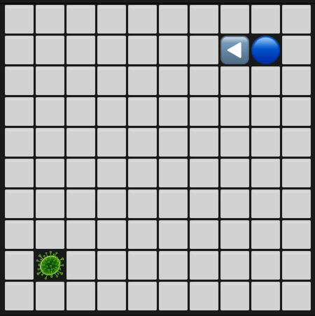

# 🪱 Quantum Nematode

<p align="center">
  
</p>

This project simulates a simplified nematode (C. elegans) navigating a 2D grid maze to find food, using either a **quantum variational circuit** or a **classical neural network** as its decision-making brain. It leverages [Qiskit](https://qiskit.org) to simulate quantum behavior and integrates classical logic for the environment.

## 🧪 Features

- ✅ **Modular Quantum Brain**: Parameterized quantum circuits with 2+ qubits for decision-making
- ✅ **Classical ML Alternatives**: MLP and Q-learning brain architectures
- ✅ **Grid-World Environment**: 2D maze navigation with food-seeking behavior
- ✅ **Quantum Learning**: Parameter-shift rule for gradient-based optimization
- ✅ **Hardware Support**: Classical simulation (AerSimulator) and real quantum hardware (IBM QPU)
- ✅ **Interactive Workflows**: CLI scripts to run simulations
- 🚧 **Expandable Framework**: Modular design for research and experimentation

## 🧠 Brain Architectures

Choose from multiple brain architectures for your nematode:

- **ModularBrain**: Quantum variational circuit with modular sensory processing
- **QModularBrain**: Hybrid quantum-classical Q-learning with experience replay
- **MLPBrain**: Classical multi-layer perceptron with policy gradients (REINFORCE)
- **QMLPBrain**: Classical MLP with Deep Q-Network (DQN) learning

Select the brain architecture when running simulations:

```bash
python scripts/run_simulation.py --brain modular    # Quantum (default)
python scripts/run_simulation.py --brain qmodular  # Hybrid quantum-classical
python scripts/run_simulation.py --brain mlp       # Classical policy gradient
python scripts/run_simulation.py --brain qmlp      # Classical Q-learning
```

## 🚀 Quick Start

### 1. Install Dependencies

Install [uv](https://github.com/astral-sh/uv) for dependency management:

```bash
brew install uv
```

Install the project (choose one based on your needs):

```bash
# For CPU simulation (recommended for beginners)
uv sync --extra cpu --extra torch

# For quantum hardware access (requires IBM Quantum account)
uv sync --extra qpu

# For GPU acceleration (local installation)
uv sync --extra gpu --extra torch

# For GPU acceleration (Docker with NVIDIA GPU support)
docker compose up --build
```

> **Docker GPU Requirements**: For the Docker setup, you need Docker with NVIDIA Container Toolkit installed for GPU acceleration.

### 2. Configure Environment (Optional)

If using quantum hardware, set up your IBM Quantum API key:

```bash
cp .env.template .env
# Edit .env to add your IBM_QUANTUM_API_KEY
```

### 3. Run a Simulation

**Command Line Examples:**

```bash
# Quantum modular brain (CPU simulation)
uv run ./scripts/run_simulation.py --log-level DEBUG --show-last-frame-only --track-per-run --runs 20 --config ./configs/examples/modular_medium.yml --theme emoji

# Quantum modular brain (IBM QPU)
uv run ./scripts/run_simulation.py --log-level DEBUG --show-last-frame-only --track-per-run --runs 1 --config ./configs/examples/modular_medium.yml --theme emoji --device qpu

# Classical MLP brain
uv run ./scripts/run_simulation.py --log-level DEBUG --show-last-frame-only --track-per-run --runs 20 --config ./configs/examples/mlp_medium.yml --theme emoji

# Many-worlds quantum simulation
uv run ./scripts/run_simulation.py --log-level WARNING --show-last-frame-only --track-per-run --runs 1 --config ./configs/examples/modular_medium.yml --theme emoji --manyworlds
```

**Docker GPU Examples:**

```bash
# Run classical MLP brain with GPU acceleration
docker-compose exec quantum-nematode uv run ./scripts/run_simulation.py --log-level DEBUG --show-last-frame-only --track-per-run --runs 20 --config ./configs/examples/mlp_medium.yml --theme emoji

# Interactive Docker shell for development
docker-compose exec quantum-nematode bash
```

## � How It Works

1. **State Perception**: The nematode perceives its environment (distance to food, obstacles)
2. **Brain Processing**: The selected brain architecture processes the state
3. **Action Selection**: Brain outputs action probabilities (forward, left, right, stay)
4. **Environment Update**: Agent moves and receives reward signal
5. **Learning**: Brain parameters are updated based on reward feedback
6. **Repeat**: Process continues until food is found or maximum steps reached

### Quantum Learning Process

For quantum brains, the learning process uses:
- **Quantum Feature Encoding**: Environmental data encoded as qubit rotations
- **Parameterized Quantum Circuits**: Trainable quantum gates for decision-making
- **Parameter-Shift Rule**: Quantum gradient computation for optimization
- **Entanglement**: Quantum correlations between different sensory modules

## 📊 Example Output

The simulation provides real-time visualization of the nematode's navigation:

```
⬜️ ⬜️ ⬜️ ⬜️ ⬜️ ⬜️ ⬜️ ⬜️ ⬜️ ⬜️
⬜️ 🦠 ⬜️ ⬜️ ⬜️ ⬜️ ⬜️ ⬜️ ⬜️ ⬜️
⬜️ 🔼 ⬜️ ⬜️ ⬜️ ⬜️ ⬜️ ⬜️ ⬜️ ⬜️
⬜️ 🔵 ⬜️ ⬜️ ⬜️ ⬜️ ⬜️ ⬜️ ⬜️ ⬜️
⬜️ 🔵 ⬜️ ⬜️ ⬜️ ⬜️ ⬜️ ⬜️ ⬜️ ⬜️
⬜️ ⬜️ ⬜️ ⬜️ ⬜️ ⬜️ ⬜️ ⬜️ ⬜️ ⬜️
⬜️ ⬜️ ⬜️ ⬜️ ⬜️ ⬜️ ⬜️ ⬜️ ⬜️ ⬜️
⬜️ ⬜️ ⬜️ ⬜️ ⬜️ ⬜️ ⬜️ ⬜️ ⬜️ ⬜️
⬜️ ⬜️ ⬜️ ⬜️ ⬜️ ⬜️ ⬜️ ⬜️ ⬜️ ⬜️
⬜️ ⬜️ ⬜️ ⬜️ ⬜️ ⬜️ ⬜️ ⬜️ ⬜️ ⬜️

Run:          10/10
Steps(Avg):   35.89/10
Step:         20/300
Wins:         10

Session ID: 20250101_000000
All runs completed:
Run 1: 28 steps    Run 6: 23 steps
Run 2: 44 steps    Run 7: 40 steps
Run 3: 21 steps    Run 8: 30 steps
Run 4: 66 steps    Run 9: 29 steps
Run 5: 33 steps    Run 10: 23 steps

Average steps per run: 33.70
Average efficiency score: -19.70
Improvement metric (steps): 17.86%
Success rate: 100.00%
```

Where:
- 🦠 = Nematode agent
- 🔼 = Food target
- 🔵 = Agent's trail/body
- ⬜️ = Empty space

## 🧰 Built With

- **[Qiskit](https://qiskit.org/)**: Quantum computing framework
- **[PyTorch](https://pytorch.org/)**: Classical neural networks
- **[uv](https://github.com/astral-sh/uv)**: Modern Python dependency management
- **[Pydantic](https://pydantic.dev/)**: Data validation and settings
- **[Rich](https://rich.readthedocs.io/)**: Beautiful terminal output

## 🔬 Research Applications

This project serves as a platform for exploring:

- **Quantum Machine Learning**: Investigating quantum advantages in learning tasks
- **Biological Modeling**: Simplified models of neural decision-making
- **Hybrid Algorithms**: Combining quantum and classical computation
- **NISQ Applications**: Near-term quantum computing applications

## 🗺️ Roadmap

### Upcoming Features

- **Enhanced Brain Architectures**: More sophisticated quantum learning algorithms
- **Improved Environments**: Multi-agent scenarios and dynamic obstacles
- **Better Visualization**: Real-time learning analysis and performance tracking
- **Hardware Optimization**: Circuit compilation and quantum error mitigation
- **Research Tools**: Advanced analysis and experimentation capabilities

### Research Applications

This platform enables research in:
- Quantum advantages in machine learning tasks
- Bio-inspired quantum algorithms
- Hybrid quantum-classical computation
- Near-term quantum device applications

## 🤝 Contributing

We welcome contributions! Please see our [Contributing Guide](CONTRIBUTING.md) for complete development setup instructions, code style guidelines, testing procedures, and pull request process.

### Areas We Need Help With

- **Quantum Algorithm Development**: New quantum learning techniques
- **Environment Extensions**: Multi-agent scenarios, dynamic obstacles  
- **Visualization Tools**: Real-time learning analysis
- **Documentation**: Tutorials and examples
- **Testing**: Performance benchmarks and edge cases

## 📄 License

This project is licensed under the Apache License 2.0. See [LICENSE](LICENSE) for details.

## 🙏 Acknowledgments

- **[Q-CTRL](https://q-ctrl.com/)**: For providing quantum hardware access with Fire Opal performance management tools to suppress quantum hardware errors and optimize quantum circuits
- **C. elegans Research Community**: For inspiring this computational model
- **Qiskit Team**: For providing excellent quantum computing tools
- **Quantum ML Community**: For advancing the field of quantum machine learning
