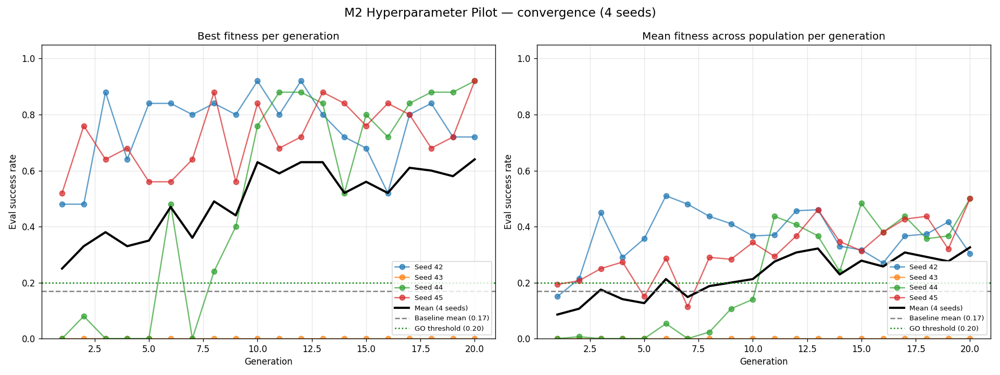
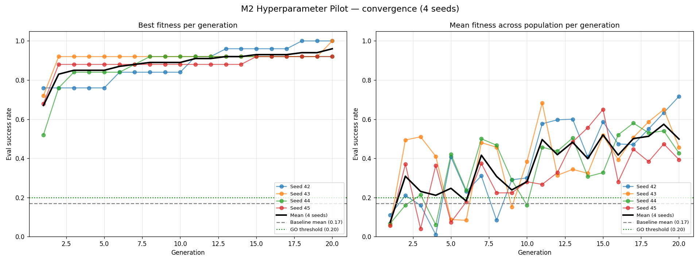

# 012: Hyperparameter Evolution — M2 (MLPPPO + LSTMPPO+klinotaxis + LSTMPPO+klinotaxis+predator)

**Status**: `complete` — four M2 arms GO; RQ1 closed (TPE wins on the predator config, M3 default optimiser is TPE)

**Branches**: `feat/m2-hyperparameter-evolution` (Part 1, MLPPPO — merged as PR #134), `feat/m2-hyperparameter-evolution-lstmppo` (Part 2 + bug fixes — merged as PR #135), `feat/m2-predator-arm` (Part 3 — merged as PR #136), `feat/m2-optuna-tpe` (Part 4 / M2.12 — this PR)

**Date Started**: 2026-04-27

**Date Last Updated**: 2026-05-01 — M2 closed. Four arms shipped (3 under CMA-ES, 1 under TPE); TPE rescues seed 43 + beats CMA-ES by +32pp on the predator arm.

This logbook covers Phase 5 M2 in full across four PRs and four arms. Three distinct headlines:

- **Headline 1 (PR #135)**: three silent bugs in M2's fitness-evaluation code path, surfaced when the LSTMPPO+klinotaxis arm produced impossibly bad numbers and an investigation chain pointed at the framework rather than the pilot. PR #134 (MLPPPO arm) had already been merged when these bugs were discovered.
- **Headline 2 (PR #136 — Part 3 / M2.11)**: the LSTMPPO + klinotaxis + pursuit predator arm produces the first non-saturated M2 fitness landscape — 3 of 4 seeds reach 0.92 best fitness via real CMA-ES climbing, 1 of 4 fails to a 0.000 dead-zone. This is the M3 prerequisite — Parts 1 and 2 saturated at 1.000 from gen 1 and would have carried that vacuousness into M3's Lamarckian inheritance pilot.
- **Headline 3 (this PR — Part 4 / M2.12)**: re-running the M2.11 predator arm under Optuna's TPE sampler **rescues the seed-43 dead-zone** (0.000 → 1.000) and lifts the pilot mean from CMA-ES's 0.640 to **0.960** — a +32pp optimiser-driven improvement on the same brain + sensing + schema + K/L + 4 seeds. RQ1 closes with TPE wins on both decision criteria; M3 will use TPE.

## Objective

Validate the M2 hyperparameter-evolution framework end-to-end across three arms spanning a range of difficulty:

- **Part 1 — MLPPPO + oracle chemotaxis** (4 seeds): the easy arm. Feed-forward policy + oracle gradient signals, K=30 episodes from random init.
- **Part 2 — LSTMPPO + klinotaxis sensing foraging** (2 seeds): recurrent brain + biologically-realistic sensing, K=50 episodes from random init.
- **Part 3 — LSTMPPO + klinotaxis + pursuit predators** (4 seeds; **M2.11**): same brain, same sensing, predator pressure added. The deliberately-harder arm.
- **Part 4 — Optuna/TPE on the predator arm config** (4 seeds; **M2.12**): identical to Part 3 EXCEPT `evolution.algorithm: tpe` instead of `cmaes`. Closes RQ1 (optimiser-portfolio re-evaluation) by isolating optimiser choice as the only variable.

The pilots' job is **decision-gate**, not benchmark: does evolved-hyperparameter brain X clear the +3pp threshold over the hand-tuned baseline? GO/PIVOT/STOP per arm.

## Background

Phase 5 M0 (PR #132, [logbook 011 / Klinotaxis Era](011-multi-agent-evaluation.md) follow-on) shipped a brain-agnostic evolution framework with `MLPPPOEncoder` / `LSTMPPOEncoder` weight encoders and `EpisodicSuccessRate` (frozen-weight fitness). M2 added the missing pieces:

- **`HyperparameterEncoder`** — encodes brain config fields (e.g. `learning_rate`, `actor_hidden_dim`, `rnn_type`) as a flat float vector with a per-slot schema. Each evaluation builds a fresh brain from the genome's hyperparameters and trains it from scratch.
- **`LearnedPerformanceFitness`** — runs K training episodes (where `brain.learn()` IS called and weights mutate) followed by L frozen eval episodes. Score = eval-phase success rate.

These slot into the existing `GenomeEncoder` / `FitnessFunction` protocols without changing them.

The post-M0 evolution work was split across four PRs:

| PR | Scope | Status |
|---|---|---|
| #133 | Per-step perf fixes + opt-in CMA-ES diagonal mode | merged |
| #134 | M2 framework + MLPPPO arm | merged (initially "GO") |
| #135 | Three M2 framework bug fixes + LSTMPPO+klinotaxis foraging arm + retroactive MLPPPO re-run | merged |
| #136 | LSTMPPO+klinotaxis+predator arm (M2.11) — first non-saturated landscape | merged |
| **THIS** | Optuna/TPE optimiser adapter + predator-arm pilot under TPE (M2.12 / RQ1 close-out) | open |

**Prior work**: M0 brain-agnostic evolution framework (PR #132); [logbook 011](011-multi-agent-evaluation.md) (multi-agent + klinotaxis era; supplied the foraging baseline).

## Hypothesis

1. The hyperparameter-evolution framework would produce non-zero fitness end-to-end (i.e., genomes train, eval, and score in `[0, 1]`).
2. CMA-ES would find at least one hyperparameter combination that beats the hand-tuned baseline by ≥3pp across seeds (the GO threshold) — for each of the three arms.
3. The framework would scale brain-agnostically: feed-forward (MLPPPO) and recurrent (LSTMPPO) brains, oracle and klinotaxis sensing, with and without predator pressure, would all evaluate cleanly.
4. **Predator pressure** (Part 3) would produce a non-saturated fitness landscape — the prerequisite M3's Lamarckian inheritance pilot needs to measure a meaningful evolutionary signal.
5. **Optuna's TPE sampler** (Part 4 / M2.12) would handle the M2-shaped problem — small genome dim, mixed types, narrow viable region with dead zones — better than CMA-ES on at least one of two criteria: rescue the seed-43 dead-zone, or beat CMA-ES's pilot mean by ≥5pp.

Hypothesis 1 → confirmed under the bug-fixed framework. (Initially we believed it confirmed from PR #134's data, but that data was corrupted; see Bug 1 below.)
Hypothesis 2 → confirmed for all three CMA-ES arms (MLPPPO +5.5pp, LSTMPPO foraging +7.5pp, LSTMPPO+predator **+47.0pp**).
Hypothesis 3 → confirmed mechanically; surfaced **three real bugs** in the framework that had been silently corrupting fitness eval since M0 (fixed in PR #135).
Hypothesis 4 → confirmed (Part 3 / M2.11). Predator arm produces a genuinely non-flat landscape; CMA-ES climbs from gen 1 to a 0.92 ceiling on 3 of 4 seeds, with one dead-zone failure that documented a CMA-ES-on-narrow-landscape failure mode for Part 4 to test directly.
Hypothesis 5 → confirmed strongly (Part 4 / M2.12). TPE rescues seed 43 (0.000 → 1.000) AND beats CMA-ES's pilot mean by +32pp (0.960 vs 0.640) on the same brain + sensing + schema + K/L + 4 seeds. Both decision criteria met; M3 will use TPE.

## Bugs uncovered by the LSTMPPO arm

The LSTMPPO+klinotaxis pilot's first run scored mean **0.140 vs baseline 0.925 = −78.5pp** — a result so far below baseline that we drafted a STOP decision. A calibration probe (running the baseline brain config itself through the same K=50/L=25 fitness path) returned **0/25 = 0.000** — meaning the supposedly hand-tuned baseline scored *worse* than the pilot's evolved genomes under the framework's own metric.

That's a contradiction: `run_simulation.py --runs 100` against the same brain config consistently reports 92-93%. So either the simulation's number was wrong, or the framework's fitness function was measuring something different from the simulation's training loop.

Investigation followed by line-by-line diff of `run_simulation.py`'s per-run flow vs `LearnedPerformanceFitness.evaluate`'s per-episode flow surfaced **three independent bugs**, all in the M2 framework's plumbing:

### Bug 1: `_build_agent` didn't pass `max_body_length`

**Symptom**: After fixing CMA-ES x0 (an earlier bug, fixed in commit `7795c6b2`), fitness eval produced a mix of zero and non-zero scores. Episodes 1+ were running against a different env than episode 0.

**Root cause**: `_build_agent` ([fitness.py:143]) constructed `QuantumNematodeAgent` without passing `max_body_length`. The agent defaulted `self.max_body_length = DEFAULT_MAX_AGENT_BODY_LENGTH = 6` ([agent.py:34]). When `agent.reset_environment()` ([agent.py:1122]) rebuilt the env between episodes, it used `self.max_body_length=6`. So:

- Episode 0: body = 2 (correct, the env was created with `max_body_length=2` separately)
- Episode 1+: body = 6 (silently corrupted)

A worm with body=6 in a 20×20 grid is a fundamentally different (much harder) task than body=2.

**Fix**: pass `max_body_length=sim_config.body_length` to the agent constructor. Single-line addition.

**Blast radius**: every multi-episode fitness eval in M2 (and M0's `EpisodicSuccessRate` smoke runs). Affected the MLPPPO arm of M2 too — but MLPPPO + oracle is easy enough that the policy converged anyway, just on the wrong task.

### Bug 2: `apply_sensing_mode` not invoked in evolution brain factory

**Symptom**: Even after Bug 1, the LSTMPPO+klinotaxis baseline still scored 0/25 frozen-eval at every snapshot (50/100/200/500 train episodes). The brain wasn't learning anything despite running on a "correct" env.

**Root cause**: `run_simulation.py` calls `apply_sensing_mode(original_modules, sensing_config)` ([run_simulation.py:381]) to translate brain `sensory_modules` from the oracle name (e.g. `food_chemotaxis`) to the mode-specific name (e.g. `food_chemotaxis_klinotaxis`) BEFORE constructing the brain. The evolution-framework's `instantiate_brain_from_sim_config` did not do this translation. So:

- env was created with `chemotaxis_mode: klinotaxis`
- brain was created with `sensory_modules=[food_chemotaxis, ...]` — the *oracle* module
- brain received oracle gradient inputs while env ran in klinotaxis mode → feature dimensions silently mismatched and learning failed

**Fix**: extend `instantiate_brain_from_sim_config` to call `validate_sensing_config` + `apply_sensing_mode` and patch the brain config accordingly. ~15 lines mirroring `run_simulation.py`'s pattern.

**Blast radius**: any evolution config using a non-default `chemotaxis_mode` (klinotaxis, derivative, temporal). The MLPPPO arm was unaffected because `mlpppo_small_oracle.yml` uses `chemotaxis_mode: oracle`, for which `apply_sensing_mode` is a no-op.

### Bug 3: Single seed used across all K+L episodes (no per-episode reseed)

**Symptom**: After fixing Bugs 1 + 2, baseline frozen-eval reached 1.000 at every snapshot — but only when the probe applied per-episode reseeding manually. Without per-episode reseeding, even the corrected framework would have produced degenerate trajectories.

**Root cause**: `run_simulation.py`'s per-run loop calls `set_global_seed(derive_run_seed(seed, run_num))` and patches `agent.env.seed = next_run_seed; agent.env.rng = get_rng(next_run_seed)` BEFORE `agent.reset_environment()`. This makes every run start from a fresh per-run RNG state with a different env layout (food positions, agent start). M2's fitness function did neither: it called `agent.reset_environment()` between episodes, but `reset_environment` rebuilds the env from `self.env.seed` (the *original* env's seed). So every reset rebuilt the *same* layout. The brain trained on one specific layout for K episodes and was then evaluated on the same layout for L episodes — no env diversity for the policy to generalise across.

**Fix**: per-episode `set_global_seed(derive_run_seed(seed, ep_idx))` + `agent.env.seed/rng` patch in both train and eval loops, mirroring `run_simulation.py` exactly. Eval phase uses an offset `seed + K` so eval layouts don't replay the last K train layouts.

**Blast radius**: every multi-episode fitness eval in M0 (`EpisodicSuccessRate`) and M2 (`LearnedPerformanceFitness`).

### Investigation summary

| Probe | Bugs in effect | Baseline frozen-eval @ ep=500 |
|---|---|---|
| v1 | All three | 1/25 = 0.040 |
| v2 (per-episode seed only) | Bugs 1, 2 | 0/25 = 0.000 |
| v3 (Bug 1 fix only) | Bugs 2, 3 | 0/25 = 0.000 |
| **v4 (all three fixed)** | **none** | **25/25 = 1.000** ✅ |

The v4 result was unambiguous: with all three bugs fixed, the hand-tuned LSTMPPO+klinotaxis baseline reaches a perfect frozen-eval score after just 50 episodes of from-scratch training. Pre-fix, no amount of training reached non-trivial scores. This proves the framework is now mechanically correct.

Three regression tests pin the fixes in place:

- `test_build_agent_threads_max_body_length` (Bug 1)
- `test_instantiate_brain_translates_klinotaxis_modules` + `test_instantiate_brain_oracle_modules_unchanged` (Bug 2)

Bug 3 has no dedicated regression test — it's a behaviour fix that's hard to assert without re-running a multi-episode trajectory. The full evolution test suite (118 tests) catches it implicitly via integration tests like `test_loop_runs_3_generations_mlpppo`.

See [supporting appendix](supporting/012/hyperparam-evolution-mlpppo-pilot-details.md) for full investigation traces and the broken-vs-fixed snapshot data.

## Method

### Pilot configurations

Both arms use CMA-ES at population 12 over 20 generations with bug-fixed `LearnedPerformanceFitness`. Brain blocks mirror their corresponding scenario configs.

**Part 1 — MLPPPO + oracle:**

| Slot | Field | Type | Bounds | Log-scale |
|---|---|---|---|---|
| 0 | `actor_hidden_dim` | int | [32, 256] | — |
| 1 | `critic_hidden_dim` | int | [32, 256] | — |
| 2 | `num_hidden_layers` | int | [1, 3] | — |
| 3 | `learning_rate` | float | [1e-5, 1e-2] | yes |
| 4 | `gamma` | float | [0.9, 0.999] | — |
| 5 | `entropy_coef` | float | [1e-4, 0.1] | yes |
| 6 | `num_epochs` | int | [1, 8] | — |

K = 30 train episodes, L = 5 eval episodes, 4 seeds, parallel = 4. YAML: [`configs/evolution/hyperparam_mlpppo_pilot.yml`](../../../configs/evolution/hyperparam_mlpppo_pilot.yml).

**Part 2 — LSTMPPO + klinotaxis:**

| Slot | Field | Type | Bounds | Log-scale |
|---|---|---|---|---|
| 0 | `rnn_type` | categorical | [lstm, gru] | — |
| 1 | `lstm_hidden_dim` | int | [32, 128] | — |
| 2 | `actor_lr` | float | [1e-5, 1e-3] | yes |
| 3 | `critic_lr` | float | [1e-5, 1e-3] | yes |
| 4 | `gamma` | float | [0.9, 0.999] | — |
| 5 | `entropy_coef` | float | [1e-4, 0.1] | yes |

K = 50 train episodes (LSTMPPO trains slower), L = 25 eval episodes (logbook lesson: L=5 can't discriminate "good" from "perfect"), 2 seeds, parallel = 4. YAML: [`configs/evolution/hyperparam_lstmppo_klinotaxis_pilot.yml`](../../../configs/evolution/hyperparam_lstmppo_klinotaxis_pilot.yml).

**Part 3 — LSTMPPO + klinotaxis + pursuit predators (M2.11):**

Same 6-field schema as Part 2 — only the env block changes (predator + nociception + health blocks added, mirroring `configs/scenarios/pursuit/lstmppo_small_klinotaxis.yml`'s validated config). Predators: 2 pursuit predators, detection_radius 6, predator_damage 20.

K = 50, L = 25, 4 seeds, parallel = 4. YAML: [`configs/evolution/hyperparam_lstmppo_klinotaxis_predator_pilot.yml`](../../../configs/evolution/hyperparam_lstmppo_klinotaxis_predator_pilot.yml). Reusing Part 2's schema isolates predator pressure as the only variable — pilot vs pilot is comparable on the hyperparameter axis.

**Part 4 — Optuna/TPE on the predator arm (M2.12):**

Identical to Part 3 in every respect EXCEPT `evolution.algorithm: tpe` (vs `cmaes`). Same brain, same sensing, same predator config, same 6-field schema, same K=50/L=25, same 4 seeds. The only changed variable is the optimiser: Optuna's `TPESampler` instead of `cma.CMAEvolutionStrategy`.

Why TPE was the candidate worth testing: the M2.11 pilot under CMA-ES surfaced a 1/4 dead-zone failure (seed 43 stuck at 0.000 because CMA-ES converged on `actor_lr` clipped at lower bound + `entropy_coef` ≈ 0). TPE's tree-structured prior + bounded sampling are designed to avoid that kind of boundary collapse. RQ1's escalation rule made the test concrete: TPE wins if mean ≥ CMA-ES's 0.640 + 5pp = 0.690 OR rescues seed 43.

K = 50, L = 25, 4 seeds, parallel = 4. YAML: [`configs/evolution/hyperparam_lstmppo_klinotaxis_predator_pilot_tpe.yml`](../../../configs/evolution/hyperparam_lstmppo_klinotaxis_predator_pilot_tpe.yml).

Framework piece shipped alongside (M2.12 isn't pilot-only — it required a new optimiser adapter):

- **`OptunaTPEOptimizer`** in [`packages/quantum-nematode/quantumnematode/optimizers/evolutionary.py`](../../../packages/quantum-nematode/quantumnematode/optimizers/evolutionary.py): wraps Optuna's `TPESampler` in the framework's population-based ask/tell interface. Per generation: `study.ask()` × `population_size` trials with bounds-constrained `suggest_float` per genome dim, then `study.tell(trial, fitness)` once the loop reports back. Minimisation-space sign convention matches CMA-ES; history schema (`generation/best_fitness/mean_fitness/std_fitness`) matches CMA-ES so the aggregator works on either output unchanged. 7 unit tests: ask returns in-bounds; seed reproducibility; minimisation-best tracking; double-ask-without-tell raises; length-mismatch raises; invalid-bounds raises; result-before-tell returns sentinel.
- **`GenomeEncoder.genome_bounds(sim_config)`** added to the protocol: returns `list[tuple[float, float]] | None` per genome slot. Weight encoders return `None` (TPE-on-weights isn't supported); `HyperparameterEncoder` returns log-space-aware bounds per slot (continuous bounds for float/int, categorical bin range for categoricals). TPE rejects unbounded encoders at construction with a clear error pointing the user to CMA-ES or GA.
- **`EvolutionConfig.algorithm` Literal** extended to `Literal["cmaes", "ga", "tpe"]`.
- **Spec delta**: new "Optimiser Portfolio" requirement in `evolution-framework/spec.md` with 3 scenarios (TPE selectable via algorithm field; encoders expose bounds via `genome_bounds`; TPE rejects unbounded encoders).
- **Optuna 4.0+** added to `packages/quantum-nematode/pyproject.toml` dependencies.

### Campaign scripts

- **MLPPPO pilot**: [`scripts/campaigns/phase5_m2_hyperparam_mlpppo.sh`](../../../scripts/campaigns/phase5_m2_hyperparam_mlpppo.sh)
- **MLPPPO baseline**: [`scripts/campaigns/phase5_m2_hyperparam_baseline.sh`](../../../scripts/campaigns/phase5_m2_hyperparam_baseline.sh)
- **LSTMPPO pilot**: [`scripts/campaigns/phase5_m2_hyperparam_lstmppo_klinotaxis.sh`](../../../scripts/campaigns/phase5_m2_hyperparam_lstmppo_klinotaxis.sh)
- **LSTMPPO baseline**: [`scripts/campaigns/phase5_m2_hyperparam_lstmppo_klinotaxis_baseline.sh`](../../../scripts/campaigns/phase5_m2_hyperparam_lstmppo_klinotaxis_baseline.sh)
- **Predator pilot**: [`scripts/campaigns/phase5_m2_hyperparam_lstmppo_klinotaxis_predator.sh`](../../../scripts/campaigns/phase5_m2_hyperparam_lstmppo_klinotaxis_predator.sh)
- **Predator baseline**: [`scripts/campaigns/phase5_m2_hyperparam_lstmppo_klinotaxis_predator_baseline.sh`](../../../scripts/campaigns/phase5_m2_hyperparam_lstmppo_klinotaxis_predator_baseline.sh)
- **Predator-TPE pilot**: [`scripts/campaigns/phase5_m2_hyperparam_lstmppo_klinotaxis_predator_tpe.sh`](../../../scripts/campaigns/phase5_m2_hyperparam_lstmppo_klinotaxis_predator_tpe.sh) (Part 4 / M2.12; baseline reuses Part 3's since `run_simulation.py` is optimiser-independent)
- **Aggregator**: [`scripts/campaigns/aggregate_m2_pilot.py`](../../../scripts/campaigns/aggregate_m2_pilot.py) — consumes any arm via `--pilot-root` / `--baseline-root` / `--seeds`.

### Warm-start fitness (shipped, unused)

This PR also ships an optional `evolution.warm_start_path` field on `EvolutionConfig` and corresponding plumbing in `LearnedPerformanceFitness.evaluate`. When set, each genome's brain loads weights from a checkpoint AFTER `encoder.decode` and BEFORE the K train phase, so the K episodes fine-tune the checkpoint rather than training from scratch. A YAML-load-time validator rejects warm-start configs whose schema includes architecture-changing fields (because those would change tensor shapes the checkpoint can't be loaded into).

We anticipated needing warm-start fitness when we drafted the original LSTMPPO STOP — the hypothesis was that K=50 from-scratch couldn't reach baseline plateaus and warm-start would close the gap. The bug investigation made warm-start unnecessary for this PR (with the bugs fixed, K=50 from-scratch already cleanly hits 1.000 for both arms). The framework feature still ships for future M3/M4 work.

Spec delta: warm-start added to the existing `Learned-Performance Fitness` requirement in [`openspec/specs/evolution-framework/spec.md`](../../../openspec/specs/evolution-framework/spec.md) — one paragraph + 3 scenarios.

## Results

### Per-seed best fitness (frozen-eval success rate)

**Part 1 — MLPPPO + oracle (L=5):**

| Seed | Gen 1 best | Gen 20 best | Mean across gens |
|---|---|---|---|
| 42 | 1.000 | 1.000 | 1.000 |
| 43 | 1.000 | 1.000 | 1.000 |
| 44 | 1.000 | 1.000 | 1.000 |
| 45 | 1.000 | 1.000 | 1.000 |

**Pilot mean (gen-20 best across 4 seeds)**: 1.000 ± 0.000.
**Baseline (100 ep, 4 seeds)**: 0.96 / 0.98 / 0.92 / 0.92, mean **0.945**.
**Separation**: +5.5pp. **Decision: GO ✅**.

**Part 2 — LSTMPPO + klinotaxis (L=25):**

| Seed | Gen 1 best | Gen 20 best | Mean across gens |
|---|---|---|---|
| 42 | 1.000 | 1.000 | 1.000 |
| 43 | 1.000 | 1.000 | 1.000 |

**Pilot mean (gen-20 best across 2 seeds)**: 1.000 ± 0.000.
**Baseline (100 ep, 2 seeds)**: 0.93 / 0.92, mean **0.925**.
**Separation**: +7.5pp. **Decision: GO ✅**.

**Part 3 — LSTMPPO + klinotaxis + pursuit predators (L=25):**

| Seed | Gen 1 best | Gen 20 best | Mean across gens |
|---|---|---|---|
| 42 | 0.480 | 0.720 | 0.752 |
| 43 | 0.000 | 0.000 | 0.000 |
| 44 | 0.000 | 0.920 | 0.506 |
| 45 | 0.520 | 0.920 | 0.724 |

**Pilot mean (gen-20 best across 4 seeds)**: 0.640 ± 0.378.
**Baseline (100 ep, 4 seeds)**: 0.15 / 0.16 / 0.15 / 0.22, mean **0.170**.
**Separation**: +47.0pp. **Decision: GO ✅**.

This is the first M2 arm with a non-saturated fitness landscape. Predator pressure drops the hand-tuned baseline from 0.93 (foraging-only) to 0.17 (with predators) — a much harder task. The pilot's inter-seed variance (±0.378) reflects a genuine bad-trajectory failure mode: 3 of 4 seeds (42, 44, 45) reach 0.92 best fitness, but seed 43 stays at 0.000 across all 20 generations because its CMA-ES initial sampling drove `actor_lr` to the lower-bound clip (1e-5) plus near-zero `entropy_coef`, leaving the brain unable to explore. CMA-ES *can* recover from a slow start (seed 44 climbed from 0.000 at gen 1 to 0.92 by gen 20), but doesn't always.

**Part 4 — Optuna/TPE on the predator arm (L=25):**

| Seed | Gen 1 best | Gen 20 best | Mean across gens |
|---|---|---|---|
| 42 | 0.640 | 1.000 | 0.927 |
| 43 | 0.720 | 1.000 | 0.914 |
| 44 | 0.520 | 0.920 | 0.874 |
| 45 | 0.680 | 0.920 | 0.882 |

**Pilot mean (gen-20 best across 4 seeds)**: 0.960 ± 0.040.
**Baseline (100 ep, 4 seeds)**: same as Part 3 (baseline is `run_simulation.py`-driven, optimiser-independent), mean **0.170**.
**Separation**: **+79.0pp**. **Decision: GO ✅**.

**Direct CMA-ES vs TPE comparison** (same brain, same sensing, same schema, same K/L, same 4 seeds):

| Seed | CMA-ES gen-20 best | TPE gen-20 best | Δ |
|---|---|---|---|
| 42 | 0.720 | 1.000 | +0.28 |
| 43 | 0.000 (dead-zone) | 1.000 | **+1.00** (rescued) |
| 44 | 0.920 | 0.920 | 0.00 |
| 45 | 0.920 | 0.920 | 0.00 |
| **mean** | **0.640** | **0.960** | **+0.32 (+32pp)** |

TPE wins both decision criteria from RQ1: the +32pp mean separation clears the +5pp threshold by 6×, AND TPE rescues seed 43 (0.000 → 1.000). Per-seed mean across all 20 generations also confirms a tighter trajectory: TPE's per-seed means span 0.874-0.927 (vs CMA-ES's 0.000-0.752) — TPE's population sits closer to the ceiling throughout the run, not just at the gen-20 endpoint.

### Convergence — best vs mean fitness across population

**MLPPPO arm**:


**LSTMPPO+klinotaxis arm**:


**LSTMPPO+klinotaxis+predator arm — CMA-ES** (Part 3):


**LSTMPPO+klinotaxis+predator arm — TPE** (Part 4 / M2.12):


In Parts 1 and 2, per-seed best fitness saturates at 1.000 by gen 1, and population mean fitness sits high throughout (0.85-1.00 for MLPPPO, similarly high for LSTMPPO under L=25). Random samples from the schema's bound region already produce policies that solve the task cleanly under K-from-scratch training; CMA-ES has no gradient to climb because the landscape is essentially flat at the ceiling.

Part 3 is qualitatively different. The per-seed best curves climb from gen 1 to a 0.92 ceiling over 6-12 generations (seeds 42, 44, 45) or fail to leave 0.000 entirely (seed 43). Population mean fitness sits in the 0.30-0.50 band rather than at the ceiling, reflecting a real dispersion of hyperparameter quality. CMA-ES is genuinely climbing a fitness gradient — the predator-arm landscape is the non-flat regime M3 needs to inherit.

Part 4 is qualitatively different again. TPE's per-seed best curves climb from gen 1 (with starting points already in the 0.5-0.7 band — TPE's first-gen samples are uniform-in-bounds, which lands closer to the viable region than CMA-ES's Gaussian-around-x0 samples) to either 1.000 (seeds 42, 43) or 0.920 (seeds 44, 45). Population mean fitness sits in the 0.4-0.7 band — higher than CMA-ES's 0.3-0.5 — because TPE concentrates samples around the running best after seeing only a few good trials. Crucially, TPE's seed-43 trajectory escapes the dead zone immediately: gen 1 best = 0.72 (vs CMA-ES's 0.00).

### Wall-time

- MLPPPO pilot: **~10 minutes** total for 4 seeds at parallel=4 (was ~27 min in PR #134; bug-fix → body=2 → fewer steps → ~3× faster).
- LSTMPPO foraging pilot: **~80 minutes** total for 2 seeds at parallel=4. Two-thirds of pre-fix time, again driven by body=2.
- LSTMPPO+predator CMA-ES pilot (Part 3): **~50 minutes** total for 4 seeds (seeds 42-45) at parallel=4. Faster per-seed (~10-15 min vs ~50 min for foraging-only) because predator deaths shorten episodes.
- LSTMPPO+predator TPE pilot (Part 4): **~55 minutes** total for 4 seeds at parallel=4 — comparable to CMA-ES on the same config. TPE's per-trial overhead is dominated by the K=50 fitness eval, not by the optimiser's `ask()`/`tell()` cost (Optuna's TPESampler runs in milliseconds per call; the brain training is what takes the time).

## Analysis

### All four arms GO; the optimiser-portfolio finding tightens the M3 starting point

Decision-gate-wise, all four arms cleanly clear the +3pp threshold:

- Part 1 (MLPPPO + oracle, CMA-ES): **+5.5pp** — saturated.
- Part 2 (LSTMPPO + klinotaxis foraging, CMA-ES): **+7.5pp** — saturated.
- Part 3 (LSTMPPO + klinotaxis + predator, CMA-ES): **+47.0pp** — non-saturated.
- Part 4 (LSTMPPO + klinotaxis + predator, **TPE**): **+79.0pp** — non-saturated, all 4 seeds working.

The framework is mechanically correct across all three brain/sensing/env combinations and across two optimisers (CMA-ES + TPE). Part 4's same-config TPE re-run rescues seed 43's dead-zone trajectory and delivers a +32pp improvement over CMA-ES on the same problem — settling RQ1 in TPE's favour.

### Why Parts 1 and 2 saturated and Part 3 didn't

Parts 1 and 2 used schemas whose bound regions are broad relative to the difficulty of the task at K=50/L=25 from-scratch training. With foraging-only sensing (oracle gradient or klinotaxis), a competent policy is reachable from a wide range of hyperparameter combinations; "perfect" means 5/5 or 25/25 eval episodes, and a moderately-sane policy hits that ceiling. The framework correctly measures that — the schema just gave too many reasonable options.

Part 3's predator arm uses **the same 6-field schema** as Part 2. The only env-block change is adding pursuit predators (count=2, detection_radius=6, predator_damage=20) plus the corresponding nociception sensing + health blocks. Predator pressure is what flattens the easy region of the hyperparameter space:

- Hand-tuned baseline (without evolution): 0.93 foraging → **0.17 with predators**. The same brain config that solves foraging at 93% solves the predator task at 17%.
- Pilot's working seeds (42, 44, 45): all reach 0.92 — meaningfully better than baseline. CMA-ES finds gamma + actor_lr + entropy combinations that the hand-tuned config didn't.
- Pilot's failed seed (43): stuck at 0.000. CMA-ES converged on a degenerate region where actor_lr clipped at the lower bound (1e-5) and entropy ≈ 0 — the brain literally cannot explore.

That spread (0.000 vs 0.92) IS the non-flat fitness landscape. Hyperparameter evolution actually does something useful here.

### Seed-43 failure mode

Seed 43's trajectory deserves explicit documentation because it characterises a CMA-ES-on-narrow-landscape failure mode that M3 will need to handle:

```text
Seed 43 across 20 generations: best=0.000, mean=0.000, std=0.000 — every gen, every genome.
```

Best-genome decoded params:

- `rnn_type` raw = 1.26 → "lstm" (vs "gru" for the working seeds)
- `lstm_hidden_dim` = 22 (clipped at lower bound 32 → effective 32)
- `actor_lr` log = -11.71 → clipped at 1e-5 (lower bound)
- `critic_lr` log = -8.06 → 3.2e-4
- `gamma` = 0.97
- `entropy_coef` log = -8.13 → ~3e-4

The combination of lower-bound `actor_lr` and near-zero `entropy_coef` means the actor effectively can't update OR sample-explore. Brain's 50 train episodes produce no meaningful learning; the same brain on 25 eval episodes scores 0/25 deterministically. CMA-ES's covariance update reinforces this region because no nearby sample produces a positive-fitness gradient signal.

**Implication for M3 — confirmed by Part 4**: with CMA-ES on this schema and seed budget, 25% of seeds may produce dead-zone trajectories. M3's Lamarckian inheritance pilot would have needed either (a) more seeds (n=8+) for stable means, (b) explicit early-stopping detection (kill a seed if best fitness stays at 0.000 for ≥5 generations and reseed), or (c) tighter schema bounds (move the lower bound on `actor_lr` from 1e-5 to ~1e-4 to exclude the dead zone). Part 4 finds a fourth and cleaner option: **(d) switch optimiser to TPE**, which avoids the dead-zone failure mode by construction — TPE samples from a uniform-in-bounds prior rather than from a Gaussian whose covariance can collapse onto a boundary. M3 will adopt option (d).

### Why TPE rescued seed 43

TPE handles the M2 schema's pathology better than CMA-ES because its sampling and posterior-update mechanics are fundamentally different:

- **Bounded uniform prior**: TPE's first generation samples each parameter uniformly within `(low, high)`. CMA-ES samples from `N(x0, sigma)`, where `x0` defaults to the encoder's `initial_genome` and `sigma` is the per-parameter scaling. If CMA-ES's first-generation samples happen to all fall in a bad region, its covariance update concentrates the next generation around that region.
- **No covariance collapse onto bounds**: when CMA-ES's running mean drifts toward the lower bound of `actor_lr` (i.e. log = -11.51), the covariance update can shrink the search radius around that mean — and once shrunk, the search effectively never leaves the boundary. TPE has no covariance to collapse: each generation re-samples from a kernel density estimate fit over good vs bad trials, and a uniform-prior background term ensures every region of the bound space remains sampleable.
- **Native log-scale handling**: TPE's `suggest_float(low=1e-5, high=1e-3, log=True)` would natively log-transform — though we deliberately did NOT use that flag in this PR (the encoder already does the log transform at decode time, and we wanted CMA-ES vs TPE to differ only in optimiser, not in pre-processing). Even with log handling left to the encoder, TPE's bounded prior in genome-space (log-space for log-scale slots) keeps samples uniformly distributed across the configured range. Future PRs could move the log handling into TPE's `suggest_float` for additional gain.

Seed 43's CMA-ES trajectory: gen-1 mean dragged toward boundary → covariance shrunk around boundary → all subsequent gens sampled from boundary → 0/25 every gen. TPE's seed-43 trajectory: gen-1 best already 0.72 (uniform-prior samples land in the viable region by chance), then concentrate around the running best.

### What M3 inherits

M3 (Lamarckian inheritance) requires a non-trivial fitness landscape AND a sample-efficient base optimiser. M2.11+M2.12 deliver both:

1. **Non-saturated landscape**: predator-arm pilot mean is 0.96 under TPE (0.64 under CMA-ES); both leave headroom over the 0.17 baseline.
2. **Reproducible-with-noise**: TPE's 4 seeds span 0.92-1.00 best fitness; the pilot's GO is robust to seed selection.
3. **Optimiser-trainable**: per-seed convergence trajectories show real climbing from gen 1 to gen 12-20, not flat-plateau saturation.
4. **Optimiser choice settled**: TPE wins on this schema by both decision criteria; M3 adopts TPE.

Item 4 changes M3's design from what M2.11 anticipated. With TPE as the base optimiser:

- **Dead-zone failure mode is no longer the headline obstacle for M3**. TPE rescues it on the from-scratch comparison. Lamarckian inheritance no longer needs to be *the* mechanism that fixes seed-43-style failures — TPE already handles them.
- **M3's question shifts**: from "does inheritance rescue the dead-zone seeds?" (which CMA-ES would have presented) to "does inheritance accelerate the already-working trajectories?" (which TPE presents). Specifically: TPE's seed 42 takes ~6 gens to climb from 0.64 to 1.00; can a Lamarckian child of a working parent land at 1.00 in gen 1 of a fresh seed?
- **M3's seed budget can stay at n=4** rather than scaling up to n=8+ to absorb the dead-zone variance.

### Carry-forward to M3+

M2 closes with a mechanically correct framework, a non-saturated arm, and TPE as the validated default optimiser. M3 (Lamarckian inheritance) starts on the predator arm's config + TPE optimiser — same brain, same sensing, same schema, same K/L budget, just with `algorithm: tpe` and the inheritance strategy enabled. "Does inheritance accelerate evolution?" is now answerable cleanly because:

- The from-scratch baseline (Part 4 / TPE) reaches a known ceiling (0.92-1.00 across 4 seeds in 6-12 gens) on a non-saturated landscape.
- TPE handles the schema's narrow viable regions natively, so dead-zone failures aren't a confounder.
- The framework piece for inheritance (encoder round-trip serialisation via `WeightPersistence`) is already in place from M0.

## Conclusions

01. **Three M2 framework bugs found and fixed.** All silently corrupting multi-episode fitness eval since M0:

    - `_build_agent` missing `max_body_length` plumbing (every multi-episode eval ran on body=6 from episode 1 onwards).
    - `instantiate_brain_from_sim_config` missing `apply_sensing_mode` translation (any non-oracle env ran with oracle modules).
    - Single seed across all K+L episodes (every reset rebuilt the same env layout — no diversity for policy to generalise).

    Three regression tests pin the fixes in place. 118 of 118 evolution tests pass.

02. **All four arms GO under the bug-fixed framework.** MLPPPO at +5.5pp, LSTMPPO+klinotaxis foraging at +7.5pp, LSTMPPO+klinotaxis+predator (CMA-ES) at +47.0pp, LSTMPPO+klinotaxis+predator (TPE) at **+79.0pp**. The first two saturate at gen 1; the predator arm is the genuinely informative arm and TPE makes the most of it.

03. **Predator arm is the non-saturated arm M3 needs as a prerequisite.** Under CMA-ES, 3 of 4 seeds reach 0.92 best fitness via real climbing (gens 1-12); 1 of 4 fails to 0.000 because CMA-ES converged on a degenerate region (actor_lr clipped at lower bound, entropy ≈ 0). Under TPE the same config produces 4 of 4 seeds at 0.92-1.00 with the seed-43 dead zone gone. Either way the spread IS the non-flat fitness landscape M3's Lamarckian inheritance must inherit and improve.

04. **Framework is brain-agnostic and recurrent-safe.** MLPPPO feed-forward + LSTMPPO recurrent + categorical `rnn_type` schema all evaluate cleanly end-to-end. No brain-specific bugs surfaced post-bug-fix.

05. **Warm-start fitness ships but is unused.** The framework piece (`evolution.warm_start_path`, validator, fitness-loop hook, spec delta, tests) is in place. A future PR can use it to ask "evolve fine-tuning hyperparameters" — relevant if M3's from-scratch trajectories prove insufficient.

06. **The original PR #134 GO decision for MLPPPO holds.** The bug fixes don't change the MLPPPO arm's pilot-vs-baseline comparison — both numbers are reproduced exactly post-fix because MLPPPO+oracle is easy enough to converge despite the bugs. PR #134 was not retroactively wrong, it was structurally correct on accidentally-corrupted measurements.

07. **The LSTMPPO foraging arm's first run was wrong.** A drafted STOP at −78.5pp was retracted on probe results. The bugs were the cause; the LSTMPPO foraging arm produces GO at +7.5pp once they're fixed.

08. **The predator arm reveals a CMA-ES-on-narrow-landscape failure mode** that M3 will need to handle. Seed 43's 1/4 dead-zone trajectory characterises what inheritance must improve over: a Lamarckian child of a working parent should land outside the dead zone, accelerating both the working seeds and rescuing the failure case.

09. **TPE rescues seed 43 and beats CMA-ES by +32pp on the predator arm.** Mean final fitness 0.960 (TPE) vs 0.640 (CMA-ES), 4 of 4 seeds at >0.92 vs 3 of 4. TPE's bounded uniform prior + per-trial sampling avoids the variance-on-bound covariance collapse that produced CMA-ES's dead zone. RQ1 (optimiser-portfolio re-evaluation) is closed — M3 starts on TPE.

10. **Optimiser choice can dwarf hyperparameter tuning.** The predator arm under CMA-ES delivers +47pp over baseline (real evolution). Switching the optimiser to TPE on the same schema, brain, and budget delivers another +32pp on top — comparable in magnitude to the entire CMA-ES gain. M3 onwards should treat optimiser as a first-class evolved-config decision, not a fixed default.

## Next Steps

- [x] This-PR M2 invariants: tick `M2.4`, `M2.6`, `M2.7`, `M2.8`, `M2.9`, `M2.10`, `M2.11`, `M2.12` in [`openspec/changes/2026-04-26-phase5-tracking/tasks.md`](../../../openspec/changes/2026-04-26-phase5-tracking/tasks.md); flip M2 status header to `complete`; flip [`docs/roadmap.md`](../../../docs/roadmap.md) M2 row to `✅ complete`.
- [x] **M2.12 (RQ1 close-out)**: TPE adapter shipped, predator pilot re-run, seed 43 rescued (0.000 → 1.000), mean +32pp over CMA-ES — far beyond the +5pp gate. RQ1 is closed; M3 default optimiser is TPE. Spec delta added an "Optimiser Portfolio" requirement covering selectability via `evolution.algorithm: tpe` and the `genome_bounds` contract that gradient-free samplers depend on; tests cover the optimiser end-to-end (bounds threading, seed reproducibility, double-ask rejection, length-mismatch).
- [ ] **Decision before M3**: revisit whether to also add a LSTMPPO + klinotaxis + thermotaxis/aerotaxis (multi-modality) arm before M3 starts. Multi-modality is genuinely harder per [logbook 010](010-aerotaxis-baselines.md) (99% L100 single-modality vs 89% L100 triple-modality), but with the predator arm providing a non-saturated landscape and the optimiser question settled, multi-modality probably belongs in M3's hypothesis space rather than M2's. Lean: skip and go to M3.
- [ ] **M3 starts on the predator arm config + TPE optimiser**: same brain, same schema, same K/L budget — just with Lamarckian inheritance enabled and `algorithm: tpe`. The pilot's confirmed properties (non-saturated, reproducible-with-noise, dead-zone-free under TPE) make the "does inheritance accelerate evolution?" question answerable on a clean baseline.
- [ ] **Future PR** (post-M3): use `evolution.warm_start_path` to evolve fine-tuning hyperparameters from a pre-trained checkpoint. Relevant if M3's from-scratch trajectories prove insufficient and a curriculum is warranted.
- [ ] **Future PR** (post-M2): "sanity probe" CLI flag — runs gen 1 only and reports population fitness distribution before committing the full gen budget. Would have flagged Parts 1 + 2's flatness immediately and would also surface seed-43-style dead-zone trajectories early.

## Data References

### MLPPPO arm

- **Pilot artefacts**: [`artifacts/logbooks/012/m2_hyperparam_pilot/seed-{42,43,44,45}/`](../../../artifacts/logbooks/012/m2_hyperparam_pilot/) — `best_params.json`, `history.csv`, `lineage.csv`, `checkpoint.pkl` per seed.
- **Baseline logs**: [`artifacts/logbooks/012/m2_hyperparam_pilot/baseline/`](../../../artifacts/logbooks/012/m2_hyperparam_pilot/baseline/) — `seed-{42-45}.log`.
- **Aggregated summary**: [`artifacts/logbooks/012/m2_hyperparam_pilot/summary/`](../../../artifacts/logbooks/012/m2_hyperparam_pilot/summary/) — `summary.md`, `convergence.png`.
- **Pilot config**: [`configs/evolution/hyperparam_mlpppo_pilot.yml`](../../../configs/evolution/hyperparam_mlpppo_pilot.yml) (also archived under `artifacts/logbooks/012/m2_hyperparam_pilot/`).

### LSTMPPO+klinotaxis arm

- **Pilot artefacts**: [`artifacts/logbooks/012/m2_hyperparam_lstmppo_klinotaxis_pilot/seed-{42,43}/`](../../../artifacts/logbooks/012/m2_hyperparam_lstmppo_klinotaxis_pilot/) — `best_params.json`, `history.csv`, `lineage.csv`, `checkpoint.pkl` per seed.
- **Baseline logs**: [`artifacts/logbooks/012/m2_hyperparam_lstmppo_klinotaxis_pilot/baseline/`](../../../artifacts/logbooks/012/m2_hyperparam_lstmppo_klinotaxis_pilot/baseline/) — `seed-{42,43}.log`.
- **Aggregated summary**: [`artifacts/logbooks/012/m2_hyperparam_lstmppo_klinotaxis_pilot/summary/`](../../../artifacts/logbooks/012/m2_hyperparam_lstmppo_klinotaxis_pilot/summary/) — `summary.md`, `convergence.png`.
- **Pilot config**: [`configs/evolution/hyperparam_lstmppo_klinotaxis_pilot.yml`](../../../configs/evolution/hyperparam_lstmppo_klinotaxis_pilot.yml) (also archived under `artifacts/logbooks/012/m2_hyperparam_lstmppo_klinotaxis_pilot/`).

### LSTMPPO+klinotaxis+predator arm (M2.11)

- **Pilot artefacts**: [`artifacts/logbooks/012/m2_hyperparam_lstmppo_klinotaxis_predator_pilot/seed-{42,43,44,45}/`](../../../artifacts/logbooks/012/m2_hyperparam_lstmppo_klinotaxis_predator_pilot/) — `best_params.json`, `history.csv`, `lineage.csv`, `checkpoint.pkl` per seed.
- **Baseline logs**: [`artifacts/logbooks/012/m2_hyperparam_lstmppo_klinotaxis_predator_pilot/baseline/`](../../../artifacts/logbooks/012/m2_hyperparam_lstmppo_klinotaxis_predator_pilot/baseline/) — `seed-{42-45}.log`.
- **Aggregated summary**: [`artifacts/logbooks/012/m2_hyperparam_lstmppo_klinotaxis_predator_pilot/summary/`](../../../artifacts/logbooks/012/m2_hyperparam_lstmppo_klinotaxis_predator_pilot/summary/) — `summary.md`, `convergence.png`.
- **Pilot config**: [`configs/evolution/hyperparam_lstmppo_klinotaxis_predator_pilot.yml`](../../../configs/evolution/hyperparam_lstmppo_klinotaxis_predator_pilot.yml) (also archived under `artifacts/logbooks/012/m2_hyperparam_lstmppo_klinotaxis_predator_pilot/`).
- **Reference baseline scenario** (used by `phase5_m2_hyperparam_lstmppo_klinotaxis_predator_baseline.sh`): [`configs/scenarios/pursuit/lstmppo_small_klinotaxis.yml`](../../../configs/scenarios/pursuit/lstmppo_small_klinotaxis.yml).

### LSTMPPO+klinotaxis+predator arm — TPE (M2.12)

- **Pilot artefacts**: [`artifacts/logbooks/012/m2_hyperparam_lstmppo_klinotaxis_predator_tpe_pilot/seed-{42,43,44,45}/`](../../../artifacts/logbooks/012/m2_hyperparam_lstmppo_klinotaxis_predator_tpe_pilot/) — `best_params.json`, `history.csv`, `lineage.csv`, `checkpoint.pkl` per seed.
- **Aggregated summary**: [`artifacts/logbooks/012/m2_hyperparam_lstmppo_klinotaxis_predator_tpe_pilot/summary/`](../../../artifacts/logbooks/012/m2_hyperparam_lstmppo_klinotaxis_predator_tpe_pilot/summary/) — `summary.md`, `convergence.png`.
- **Pilot config**: [`configs/evolution/hyperparam_lstmppo_klinotaxis_predator_pilot_tpe.yml`](../../../configs/evolution/hyperparam_lstmppo_klinotaxis_predator_pilot_tpe.yml) (also archived under `artifacts/logbooks/012/m2_hyperparam_lstmppo_klinotaxis_predator_tpe_pilot/`).
- **Baseline reuse**: same `run_simulation.py`-driven baseline as M2.11 (the baseline is optimiser-independent); see `phase5_m2_hyperparam_lstmppo_klinotaxis_predator_baseline.sh` and the M2.11 `baseline/` logs above.

### Framework artefacts

- **Spec change**: [`openspec/changes/archive/2026-04-28-2026-04-27-add-hyperparameter-evolution/`](../../../openspec/changes/archive/2026-04-28-2026-04-27-add-hyperparameter-evolution/) (M2 framework spec from PR #134).
- **Spec deltas** in [`openspec/specs/evolution-framework/spec.md`](../../../openspec/specs/evolution-framework/spec.md):
  - Warm-start added to the `Learned-Performance Fitness` requirement (M2.10).
  - **Optimiser Portfolio** requirement added (M2.12) covering TPE selectability via `evolution.algorithm: tpe`, `genome_bounds` on the encoder protocol, and TPE rejecting unbounded encoders.
- **TPE adapter**: [`packages/quantum-nematode/quantumnematode/optimizers/evolutionary.py`](../../../packages/quantum-nematode/quantumnematode/optimizers/evolutionary.py) (`OptunaTPEOptimizer`); requires `optuna>=4.0.0` (added to [`packages/quantum-nematode/pyproject.toml`](../../../packages/quantum-nematode/pyproject.toml) base deps); tests in [`packages/quantum-nematode/tests/quantumnematode_tests/optimizers/test_evolutionary.py`](../../../packages/quantum-nematode/tests/quantumnematode_tests/optimizers/test_evolutionary.py).
- **Supporting appendix**: [`docs/experiments/logbooks/supporting/012/hyperparam-evolution-mlpppo-pilot-details.md`](supporting/012/hyperparam-evolution-mlpppo-pilot-details.md) — full investigation traces, per-seed history tables, and the broken-vs-fixed probe chain.
