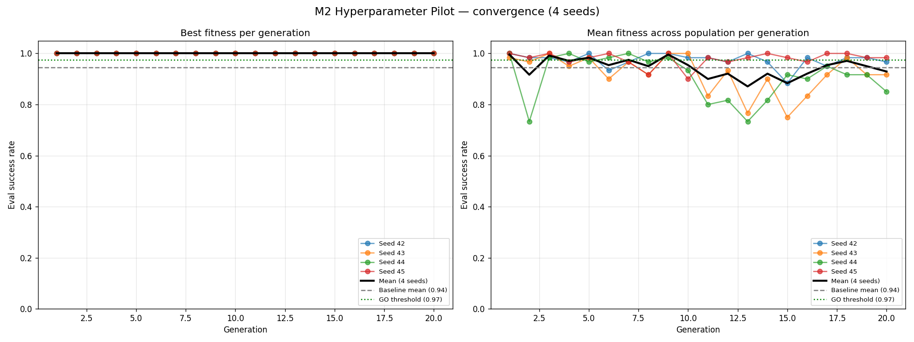
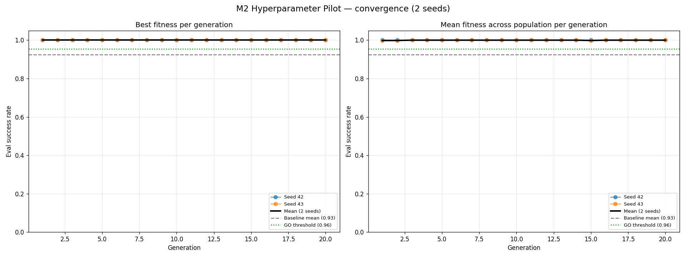

# 012: Hyperparameter Evolution — M2 (MLPPPO + LSTMPPO+klinotaxis)

**Status**: `in progress` — pilots GO but saturated; M2.11 predator arm opens a non-saturated landscape before M3 starts

**Branches**: `feat/m2-hyperparameter-evolution` (Part 1, MLPPPO — merged as PR #134), `feat/m2-hyperparameter-evolution-lstmppo` (this PR — bug fixes + LSTMPPO+klinotaxis arm)

**Date Started**: 2026-04-27

**Date Completed**: 2026-04-30

This logbook covers Phase 5 M2 in full. The headline finding is **not** the pilot results themselves — both arms hit the metric ceiling under the bug-fixed framework. The headline is the **three silent bugs in M2's fitness-evaluation code path**, surfaced when the LSTMPPO+klinotaxis arm produced impossibly bad numbers and an investigation chain pointed at the framework rather than the pilot. PR #134 (MLPPPO arm) had already been merged when these bugs were discovered.

## Objective

Validate the M2 hyperparameter-evolution framework end-to-end across two arms with markedly different fitness landscapes:

- **Part 1 — MLPPPO + oracle chemotaxis** (4 seeds): the easy arm. The brain has access to oracle gradient signals and trains a feed-forward policy from random init in K=30 episodes.
- **Part 2 — LSTMPPO + klinotaxis sensing** (2 seeds): the harder arm. Recurrent brain, klinotaxis sensing (no oracle gradients), trains a recurrent policy in K=50 episodes.

The pilots' job is **decision-gate**, not benchmark: does evolved-hyperparameter brain X clear the +3pp threshold over the hand-tuned baseline? GO/PIVOT/STOP per arm.

## Background

Phase 5 M0 (PR #132, [logbook 011 / Klinotaxis Era](011-multi-agent-evaluation.md) follow-on) shipped a brain-agnostic evolution framework with `MLPPPOEncoder` / `LSTMPPOEncoder` weight encoders and `EpisodicSuccessRate` (frozen-weight fitness). M2 added the missing pieces:

- **`HyperparameterEncoder`** — encodes brain config fields (e.g. `learning_rate`, `actor_hidden_dim`, `rnn_type`) as a flat float vector with a per-slot schema. Each evaluation builds a fresh brain from the genome's hyperparameters and trains it from scratch.
- **`LearnedPerformanceFitness`** — runs K training episodes (where `brain.learn()` IS called and weights mutate) followed by L frozen eval episodes. Score = eval-phase success rate.

These slot into the existing `GenomeEncoder` / `FitnessFunction` protocols without changing them.

The post-M0 evolution work was split into three PRs:

| PR | Scope | Status |
|---|---|---|
| #133 | Per-step perf fixes + opt-in CMA-ES diagonal mode | merged |
| #134 | M2 framework + MLPPPO arm | merged (initially "GO") |
| **THIS** | Bug fixes uncovered by LSTMPPO investigation + LSTMPPO arm + retroactive MLPPPO re-run | open |

**Prior work**: M0 brain-agnostic evolution framework (PR #132); [logbook 011](011-multi-agent-evaluation.md) (multi-agent + klinotaxis era; supplied the foraging baseline).

## Hypothesis

1. The hyperparameter-evolution framework would produce non-zero fitness end-to-end (i.e., genomes train, eval, and score in `[0, 1]`).
2. CMA-ES would find at least one hyperparameter combination that beats the hand-tuned baseline by ≥3pp across seeds (the GO threshold) — for both brain arms.
3. The framework would scale brain-agnostically: feed-forward (MLPPPO) and recurrent (LSTMPPO) brains, oracle and klinotaxis sensing, would all evaluate cleanly.

Hypothesis 1 → confirmed under the bug-fixed framework. (Initially we believed it confirmed from PR #134's data, but that data was corrupted; see Bug 1 below.)
Hypothesis 2 → confirmed for both arms post-bug-fix (MLPPPO +5.5pp, LSTMPPO +7.5pp).
Hypothesis 3 → confirmed mechanically; surfaced **three real bugs** in the framework that had been silently corrupting fitness eval since M0.

## Bugs uncovered by the LSTMPPO arm

The LSTMPPO+klinotaxis pilot's first run scored mean **0.140 vs baseline 0.925 = −78.5pp** — a result so far below baseline that we drafted a STOP decision. A calibration probe (running the baseline brain config itself through the same K=50/L=25 fitness path) returned **0/25 = 0.000** — meaning the supposedly hand-tuned baseline scored *worse* than the pilot's evolved genomes under the framework's own metric.

That's a contradiction: `run_simulation.py --runs 100` against the same brain config consistently reports 92-93%. So either the simulation's number was wrong, or the framework's fitness function was measuring something different from the simulation's training loop.

Investigation followed by line-by-line diff of `run_simulation.py`'s per-run flow vs `LearnedPerformanceFitness.evaluate`'s per-episode flow surfaced **three independent bugs**, all in the M2 framework's plumbing:

### Bug 1: `_build_agent` didn't pass `max_body_length`

**Symptom**: After fixing CMA-ES x0 (an earlier bug, fixed in commit `7795c6b2`), fitness eval produced a mix of zero and non-zero scores. Episodes 1+ were running against a different env than episode 0.

**Root cause**: `_build_agent` ([fitness.py:143]) constructed `QuantumNematodeAgent` without passing `max_body_length`. The agent defaulted `self.max_body_length = DEFAULT_MAX_AGENT_BODY_LENGTH = 6` ([agent.py:34]). When `agent.reset_environment()` ([agent.py:1122]) rebuilt the env between episodes, it used `self.max_body_length=6`. So:

- Episode 0: body = 2 (correct, the env was created with `max_body_length=2` separately)
- Episode 1+: body = 6 (silently corrupted)

A worm with body=6 in a 20×20 grid is a fundamentally different (much harder) task than body=2.

**Fix**: pass `max_body_length=sim_config.body_length` to the agent constructor. Single-line addition.

**Blast radius**: every multi-episode fitness eval in M2 (and M0's `EpisodicSuccessRate` smoke runs). Affected the MLPPPO arm of M2 too — but MLPPPO + oracle is easy enough that the policy converged anyway, just on the wrong task.

### Bug 2: `apply_sensing_mode` not invoked in evolution brain factory

**Symptom**: Even after Bug 1, the LSTMPPO+klinotaxis baseline still scored 0/25 frozen-eval at every snapshot (50/100/200/500 train episodes). The brain wasn't learning anything despite running on a "correct" env.

**Root cause**: `run_simulation.py` calls `apply_sensing_mode(original_modules, sensing_config)` ([run_simulation.py:381]) to translate brain `sensory_modules` from the oracle name (e.g. `food_chemotaxis`) to the mode-specific name (e.g. `food_chemotaxis_klinotaxis`) BEFORE constructing the brain. The evolution-framework's `instantiate_brain_from_sim_config` did not do this translation. So:

- env was created with `chemotaxis_mode: klinotaxis`
- brain was created with `sensory_modules=[food_chemotaxis, ...]` — the *oracle* module
- brain received oracle gradient inputs while env ran in klinotaxis mode → feature dimensions silently mismatched and learning failed

**Fix**: extend `instantiate_brain_from_sim_config` to call `validate_sensing_config` + `apply_sensing_mode` and patch the brain config accordingly. ~15 lines mirroring `run_simulation.py`'s pattern.

**Blast radius**: any evolution config using a non-default `chemotaxis_mode` (klinotaxis, derivative, temporal). The MLPPPO arm was unaffected because `mlpppo_small_oracle.yml` uses `chemotaxis_mode: oracle`, for which `apply_sensing_mode` is a no-op.

### Bug 3: Single seed used across all K+L episodes (no per-episode reseed)

**Symptom**: After fixing Bugs 1 + 2, baseline frozen-eval reached 1.000 at every snapshot — but only when the probe applied per-episode reseeding manually. Without per-episode reseeding, even the corrected framework would have produced degenerate trajectories.

**Root cause**: `run_simulation.py`'s per-run loop calls `set_global_seed(derive_run_seed(seed, run_num))` and patches `agent.env.seed = next_run_seed; agent.env.rng = get_rng(next_run_seed)` BEFORE `agent.reset_environment()`. This makes every run start from a fresh per-run RNG state with a different env layout (food positions, agent start). M2's fitness function did neither: it called `agent.reset_environment()` between episodes, but `reset_environment` rebuilds the env from `self.env.seed` (the *original* env's seed). So every reset rebuilt the *same* layout. The brain trained on one specific layout for K episodes and was then evaluated on the same layout for L episodes — no env diversity for the policy to generalise across.

**Fix**: per-episode `set_global_seed(derive_run_seed(seed, ep_idx))` + `agent.env.seed/rng` patch in both train and eval loops, mirroring `run_simulation.py` exactly. Eval phase uses an offset `seed + K` so eval layouts don't replay the last K train layouts.

**Blast radius**: every multi-episode fitness eval in M0 (`EpisodicSuccessRate`) and M2 (`LearnedPerformanceFitness`).

### Investigation summary

| Probe | Bugs in effect | Baseline frozen-eval @ ep=500 |
|---|---|---|
| v1 | All three | 1/25 = 0.040 |
| v2 (per-episode seed only) | Bugs 1, 2 | 0/25 = 0.000 |
| v3 (Bug 1 fix only) | Bugs 2, 3 | 0/25 = 0.000 |
| **v4 (all three fixed)** | **none** | **25/25 = 1.000** ✅ |

The v4 result was unambiguous: with all three bugs fixed, the hand-tuned LSTMPPO+klinotaxis baseline reaches a perfect frozen-eval score after just 50 episodes of from-scratch training. Pre-fix, no amount of training reached non-trivial scores. This proves the framework is now mechanically correct.

Three regression tests pin the fixes in place:

- `test_build_agent_threads_max_body_length` (Bug 1)
- `test_instantiate_brain_translates_klinotaxis_modules` + `test_instantiate_brain_oracle_modules_unchanged` (Bug 2)

Bug 3 has no dedicated regression test — it's a behaviour fix that's hard to assert without re-running a multi-episode trajectory. The full evolution test suite (118 tests) catches it implicitly via integration tests like `test_loop_runs_3_generations_mlpppo`.

See [supporting appendix](supporting/012/hyperparam-evolution-mlpppo-pilot-details.md) for full investigation traces and the broken-vs-fixed snapshot data.

## Method

### Pilot configurations

Both arms use CMA-ES at population 12 over 20 generations with bug-fixed `LearnedPerformanceFitness`. Brain blocks mirror their corresponding scenario configs.

**Part 1 — MLPPPO + oracle:**

| Slot | Field | Type | Bounds | Log-scale |
|---|---|---|---|---|
| 0 | `actor_hidden_dim` | int | [32, 256] | — |
| 1 | `critic_hidden_dim` | int | [32, 256] | — |
| 2 | `num_hidden_layers` | int | [1, 3] | — |
| 3 | `learning_rate` | float | [1e-5, 1e-2] | yes |
| 4 | `gamma` | float | [0.9, 0.999] | — |
| 5 | `entropy_coef` | float | [1e-4, 0.1] | yes |
| 6 | `num_epochs` | int | [1, 8] | — |

K = 30 train episodes, L = 5 eval episodes, 4 seeds, parallel = 4. YAML: [`configs/evolution/hyperparam_mlpppo_pilot.yml`](../../../configs/evolution/hyperparam_mlpppo_pilot.yml).

**Part 2 — LSTMPPO + klinotaxis:**

| Slot | Field | Type | Bounds | Log-scale |
|---|---|---|---|---|
| 0 | `rnn_type` | categorical | [lstm, gru] | — |
| 1 | `lstm_hidden_dim` | int | [32, 128] | — |
| 2 | `actor_lr` | float | [1e-5, 1e-3] | yes |
| 3 | `critic_lr` | float | [1e-5, 1e-3] | yes |
| 4 | `gamma` | float | [0.9, 0.999] | — |
| 5 | `entropy_coef` | float | [1e-4, 0.1] | yes |

K = 50 train episodes (LSTMPPO trains slower), L = 25 eval episodes (logbook lesson: L=5 can't discriminate "good" from "perfect"), 2 seeds, parallel = 4. YAML: [`configs/evolution/hyperparam_lstmppo_klinotaxis_pilot.yml`](../../../configs/evolution/hyperparam_lstmppo_klinotaxis_pilot.yml).

### Campaign scripts

- **MLPPPO pilot**: [`scripts/campaigns/phase5_m2_hyperparam_mlpppo.sh`](../../../scripts/campaigns/phase5_m2_hyperparam_mlpppo.sh)
- **MLPPPO baseline**: [`scripts/campaigns/phase5_m2_hyperparam_baseline.sh`](../../../scripts/campaigns/phase5_m2_hyperparam_baseline.sh)
- **LSTMPPO pilot**: [`scripts/campaigns/phase5_m2_hyperparam_lstmppo_klinotaxis.sh`](../../../scripts/campaigns/phase5_m2_hyperparam_lstmppo_klinotaxis.sh)
- **LSTMPPO baseline**: [`scripts/campaigns/phase5_m2_hyperparam_lstmppo_klinotaxis_baseline.sh`](../../../scripts/campaigns/phase5_m2_hyperparam_lstmppo_klinotaxis_baseline.sh)
- **Aggregator**: [`scripts/campaigns/aggregate_m2_pilot.py`](../../../scripts/campaigns/aggregate_m2_pilot.py) — consumes both arms via `--pilot-root` / `--baseline-root` / `--seeds`.

### Warm-start fitness (shipped, unused)

This PR also ships an optional `evolution.warm_start_path` field on `EvolutionConfig` and corresponding plumbing in `LearnedPerformanceFitness.evaluate`. When set, each genome's brain loads weights from a checkpoint AFTER `encoder.decode` and BEFORE the K train phase, so the K episodes fine-tune the checkpoint rather than training from scratch. A YAML-load-time validator rejects warm-start configs whose schema includes architecture-changing fields (because those would change tensor shapes the checkpoint can't be loaded into).

We anticipated needing warm-start fitness when we drafted the original LSTMPPO STOP — the hypothesis was that K=50 from-scratch couldn't reach baseline plateaus and warm-start would close the gap. The bug investigation made warm-start unnecessary for this PR (with the bugs fixed, K=50 from-scratch already cleanly hits 1.000 for both arms). The framework feature still ships for future M3/M4 work.

Spec delta: warm-start added to the existing `Learned-Performance Fitness` requirement in [`openspec/specs/evolution-framework/spec.md`](../../../openspec/specs/evolution-framework/spec.md) — one paragraph + 3 scenarios.

## Results

### Per-seed best fitness (frozen-eval success rate)

**Part 1 — MLPPPO + oracle (L=5):**

| Seed | Gen 1 best | Gen 20 best | Mean across gens |
|---|---|---|---|
| 42 | 1.000 | 1.000 | 1.000 |
| 43 | 1.000 | 1.000 | 1.000 |
| 44 | 1.000 | 1.000 | 1.000 |
| 45 | 1.000 | 1.000 | 1.000 |

**Pilot mean (gen-20 best across 4 seeds)**: 1.000 ± 0.000.
**Baseline (100 ep, 4 seeds)**: 0.96 / 0.98 / 0.92 / 0.92, mean **0.945**.
**Separation**: +5.5pp. **Decision: GO ✅**.

**Part 2 — LSTMPPO + klinotaxis (L=25):**

| Seed | Gen 1 best | Gen 20 best | Mean across gens |
|---|---|---|---|
| 42 | 1.000 | 1.000 | 1.000 |
| 43 | 1.000 | 1.000 | 1.000 |

**Pilot mean (gen-20 best across 2 seeds)**: 1.000 ± 0.000.
**Baseline (100 ep, 2 seeds)**: 0.93 / 0.92, mean **0.925**.
**Separation**: +7.5pp. **Decision: GO ✅**.

### Convergence — best vs mean fitness across population

**MLPPPO arm**:

**LSTMPPO+klinotaxis arm**:

In both arms, per-seed best fitness saturates at 1.000 by gen 1, and population mean fitness sits high throughout (0.85-1.00 for MLPPPO, similarly high for LSTMPPO under L=25). Random samples from the schema's bound region already produce policies that solve the task cleanly under K-from-scratch training; CMA-ES has no gradient to climb because the landscape is essentially flat at the ceiling.

### Wall-time

- MLPPPO pilot: **~10 minutes** total for 4 seeds at parallel=4 (was ~27 min in PR #134; bug-fix → body=2 → fewer steps → ~3× faster).
- LSTMPPO pilot: **~80 minutes** total for 2 seeds at parallel=4. Two-thirds of pre-fix time, again driven by body=2.

## Analysis

### Both arms GO; both arms are too easy at this configuration

Decision-gate-wise, both arms cleanly clear the +3pp threshold and produce M2 GO. The framework is now mechanically correct (verified by 118 tests + the calibration probe chain) and brain-agnostic (MLPPPO feed-forward + LSTMPPO recurrent + categorical schema all work end-to-end).

But neither arm produced a meaningful *evolutionary* result. CMA-ES saturates at gen 1 in all 6 seeds across both arms. The schema's viable region is broad enough that a single uniform draw from it already lands on a perfect-scoring genome. The 20-generation budget is mostly wasted — the optimiser can't improve on 1.000.

### Why the schemas are too easy

For both arms, the bound regions for `learning_rate` (or `actor_lr`/`critic_lr`), `gamma`, and `entropy_coef` were chosen wide intentionally — to give CMA-ES room to explore. With L=5 (MLPPPO) or L=25 (LSTMPPO) frozen-eval episodes, "perfect" means hitting 5/5 or 25/25. A genuinely competent policy reaches that ceiling for any reasonable hyperparameter combination. The framework correctly measures that competence; the schema just gave it too many reasonable options.

This was already noted in the original PR #134 logbook for the MLPPPO arm and now applies symmetrically to LSTMPPO.

### What a meaningful pilot would look like

A real pilot would need at least one of:

1. **Tighter schema bounds** with a known competent region excluded — force CMA-ES to find a non-obvious hyperparameter combination.
2. **Harder fitness metric** that isn't quickly bounded by 1.000 — e.g. training-budget efficiency (lowest K to reach success rate ≥ 0.95), wall-time-per-eval (penalise large architectures), or robustness across seeds (require all seeds at K to succeed, not the average).
3. **Warm-start fine-tuning** (now in the framework) — ask "what hyperparams produce the best fine-tune of an already-strong baseline" rather than "what hyperparams reach a usable policy fastest".

Option 3 is the natural follow-up; the framework piece shipped here is exactly what enables it.

### Carry-forward to M3+

M3 (Lamarckian inheritance) and M4 (Baldwin effect) both require non-trivial fitness landscapes — they ARE the harder regimes. M2's "framework works, but the simple from-scratch fitness saturates" finding is exactly the prerequisite M3 needs: we have a mechanically correct pipeline; M3's inheritance strategy is what creates the harder fitness signal where evolution actually matters.

## Conclusions

1. **Three M2 framework bugs found and fixed.** All silently corrupting multi-episode fitness eval since M0:

   - `_build_agent` missing `max_body_length` plumbing (every multi-episode eval ran on body=6 from episode 1 onwards).
   - `instantiate_brain_from_sim_config` missing `apply_sensing_mode` translation (any non-oracle env ran with oracle modules).
   - Single seed across all K+L episodes (every reset rebuilt the same env layout — no diversity for policy to generalise).

   Three regression tests pin the fixes in place. 118 of 118 evolution tests pass.

2. **Both arms GO under the bug-fixed framework.** MLPPPO at +5.5pp, LSTMPPO+klinotaxis at +7.5pp. Both decisions are correct but underwhelming: CMA-ES saturates at gen 1 in every seed because the schemas are too easy.

3. **Framework is brain-agnostic and recurrent-safe.** MLPPPO feed-forward + LSTMPPO recurrent + categorical `rnn_type` schema all evaluate cleanly end-to-end. No brain-specific bugs surfaced post-bug-fix.

4. **Warm-start fitness ships but is unused for this PR.** The framework piece (`evolution.warm_start_path`, validator, fitness-loop hook, spec delta, tests) is in place. A future PR can use it to ask "evolve fine-tuning hyperparameters" once the simpler from-scratch pilot saturates at 1.000.

5. **The original PR #134 GO decision for MLPPPO holds.** The bug fixes don't change the MLPPPO arm's pilot-vs-baseline comparison — both numbers are reproduced exactly post-fix because MLPPPO+oracle is easy enough to converge despite the bugs. PR #134 was not retroactively wrong, it was structurally correct on accidentally-corrupted measurements.

6. **The LSTMPPO arm's first run was wrong.** A drafted STOP at −78.5pp was retracted on probe results. The bugs were the cause; the LSTMPPO arm produces GO at +7.5pp once they're fixed.

## Next Steps

- [x] M2 close-out: tick `M2.4`, `M2.6`, `M2.8` in [`openspec/changes/2026-04-26-phase5-tracking/tasks.md`](../../../openspec/changes/2026-04-26-phase5-tracking/tasks.md); flip `docs/roadmap.md` M2 row to `✅ complete`.
- [ ] **Next PR** (M2 hardening, before M3): add a third M2 arm — **LSTMPPO + klinotaxis + pursuit predators** — to produce a non-saturated fitness landscape. Both current arms hit 1.000 in essentially every generation, which makes the pilot's GO decision vacuous (everything works, evolution never had to climb anything) and would carry that vacuousness into M3's Lamarckian inheritance pilot if not addressed. Predator pressure forces the brain to balance foraging and survival — the classic regime where gamma/entropy/lr settings differentiate policies. Same brain + sensing + scripts as the existing LSTMPPO arm; just adds predator config and a re-run. Estimated wall: ~2.5 hr.
- [ ] **Decision after that PR lands**: revisit whether to also add a LSTMPPO + klinotaxis + thermotaxis/aerotaxis (multi-modality) arm, or jump to M3. Multi-modality is genuinely harder per [logbook 010](010-aerotaxis-baselines.md) (99% L100 single-modality vs 89% L100 triple-modality) but pulls in additional sensing modules that probably belong with M3's hypothesis space, not M2's.
- [ ] **Future PR** (M3 prerequisite): use `evolution.warm_start_path` to evolve fine-tuning hyperparameters from a pre-trained checkpoint, asking "what fine-tunes a strong baseline best" rather than "what reaches a usable policy fastest".
- [ ] **Future PR** (post-M2): "sanity probe" CLI flag — runs gen 1 only and reports population fitness distribution before committing the full gen budget. Cheap to add and would have flagged both arms' flatness immediately.
- [ ] **Optimiser-portfolio re-evaluation** (already RQ1 in the Phase 5 tracking change). Optuna/TPE on a non-flat landscape (M3 fitness, or the predator arm above) would let us check whether CMA-ES is still the right default at small genome dim with mixed types.

## Data References

### MLPPPO arm

- **Pilot artefacts**: [`artifacts/logbooks/012/m2_hyperparam_pilot/seed-{42,43,44,45}/`](../../../artifacts/logbooks/012/m2_hyperparam_pilot/) — `best_params.json`, `history.csv`, `lineage.csv`, `checkpoint.pkl` per seed.
- **Baseline logs**: [`artifacts/logbooks/012/m2_hyperparam_pilot/baseline/`](../../../artifacts/logbooks/012/m2_hyperparam_pilot/baseline/) — `seed-{42-45}.log`.
- **Aggregated summary**: [`artifacts/logbooks/012/m2_hyperparam_pilot/summary/`](../../../artifacts/logbooks/012/m2_hyperparam_pilot/summary/) — `summary.md`, `convergence.png`.
- **Pilot config**: [`configs/evolution/hyperparam_mlpppo_pilot.yml`](../../../configs/evolution/hyperparam_mlpppo_pilot.yml) (also archived under `artifacts/logbooks/012/m2_hyperparam_pilot/`).

### LSTMPPO+klinotaxis arm

- **Pilot artefacts**: [`artifacts/logbooks/012/m2_hyperparam_lstmppo_klinotaxis_pilot/seed-{42,43}/`](../../../artifacts/logbooks/012/m2_hyperparam_lstmppo_klinotaxis_pilot/) — `best_params.json`, `history.csv`, `lineage.csv`, `checkpoint.pkl` per seed.
- **Baseline logs**: [`artifacts/logbooks/012/m2_hyperparam_lstmppo_klinotaxis_pilot/baseline/`](../../../artifacts/logbooks/012/m2_hyperparam_lstmppo_klinotaxis_pilot/baseline/) — `seed-{42,43}.log`.
- **Aggregated summary**: [`artifacts/logbooks/012/m2_hyperparam_lstmppo_klinotaxis_pilot/summary/`](../../../artifacts/logbooks/012/m2_hyperparam_lstmppo_klinotaxis_pilot/summary/) — `summary.md`, `convergence.png`.
- **Pilot config**: [`configs/evolution/hyperparam_lstmppo_klinotaxis_pilot.yml`](../../../configs/evolution/hyperparam_lstmppo_klinotaxis_pilot.yml) (also archived under `artifacts/logbooks/012/m2_hyperparam_lstmppo_klinotaxis_pilot/`).

### Framework artefacts

- **Spec change**: [`openspec/changes/archive/2026-04-28-2026-04-27-add-hyperparameter-evolution/`](../../../openspec/changes/archive/2026-04-28-2026-04-27-add-hyperparameter-evolution/) (M2 framework spec from PR #134).
- **Spec delta**: warm-start added to `Learned-Performance Fitness` requirement in [`openspec/specs/evolution-framework/spec.md`](../../../openspec/specs/evolution-framework/spec.md).
- **Supporting appendix**: [`docs/experiments/logbooks/supporting/012/hyperparam-evolution-mlpppo-pilot-details.md`](supporting/012/hyperparam-evolution-mlpppo-pilot-details.md) — full investigation traces, per-seed history tables, and the broken-vs-fixed probe chain.
