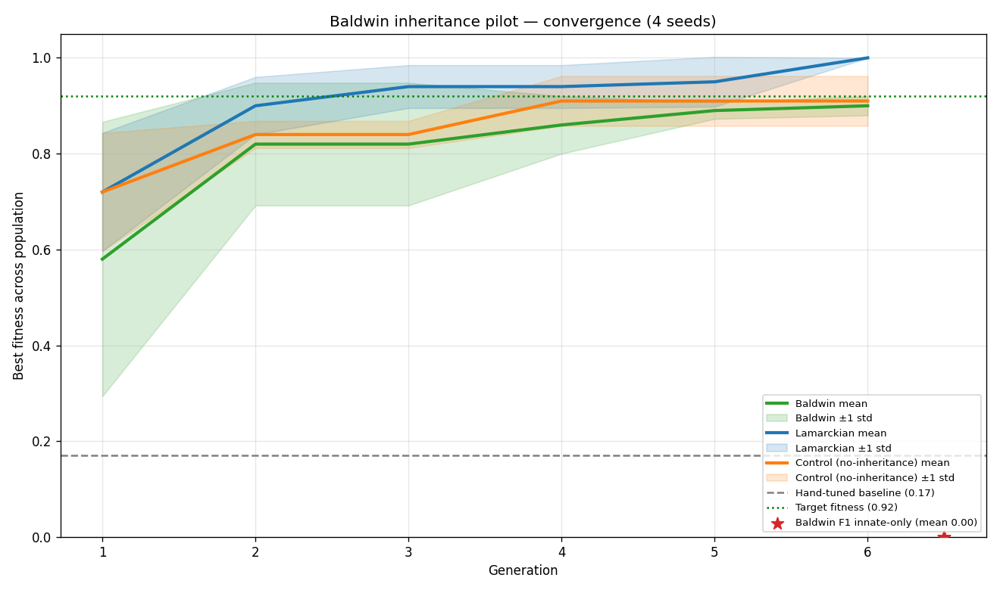

# 014: Baldwin Inheritance — M4 (LSTMPPO + klinotaxis + pursuit predators, TPE)

**Status**: `complete (framework shipped) — INCONCLUSIVE ⚠️ on the science`. The framework changes (kind() Protocol method, BaldwinInheritance strategy, two-guard loop split, weight_init_scale brain field, --early-stop-on-saturation flag) are validated and shipped. The 3-arm pilot ran cleanly and Lamarckian rerun reproduces M3 exactly. **However, a post-pilot audit found three design flaws that prevent the data from definitively answering "does Baldwin work on this codebase + arm?".** The literal aggregator verdict is STOP (Speed gate FAIL margin +0.00, Genetic-assimilation gate FAIL margin -0.17, Comparative gate PASS), but the gates were calibrated against confounded comparisons. See § Audit and § Decision below. M4.5 (the proper Baldwin re-evaluation) is recorded as the follow-up.

**Branch**: `feat/m4-baldwin-evolution` (PR pending)

**Date Started**: 2026-05-03

**Date Last Updated**: 2026-05-03 — M4 closed INCONCLUSIVE after post-pilot audit. Verdict text below preserves the literal aggregator output for traceability + adds the audit findings + a redesigned M4.5 plan. Lamarckian rerun reproduces M3 exactly (mean 4.50, all 4 seeds at 1.00) — confirms the framework changes are byte-equivalent for the M3 path.

This logbook covers Phase 5 M4 in a single PR: framework, pilot, two re-run controls (M3 lamarckian + M3 from-scratch on the M4 code revision), F1 innate-only post-pilot evaluation, the literal aggregator output, and the **post-pilot audit that demoted the verdict from STOP to INCONCLUSIVE**. The headline finding is **the framework works correctly (Lamarckian rerun reproduces M3 exactly), but the M4 experimental design has three confounders — schema-shift between Baldwin and Control, a biologically incoherent F1 test, and an apples-to-oranges F1-vs-baseline comparison — that prevent a clean answer about whether Baldwin Effect manifests on this codebase. M4.5 (a follow-up PR) will redesign the comparison.**

## Objective

Test whether **per-genome Baldwin inheritance** — recording the prior generation's elite genome ID in the lineage CSV but NOT propagating any trained weights — accelerates evolutionary convergence over the M3 from-scratch control on the M3 predator-arm configuration. The hyperparameter genome continues to evolve via TPE; the elite-ID lineage trace exists so post-pilot analysis can identify which prior-gen elite each child shares hyperparameters with via TPE's posterior. Each child trains from-scratch.

The Baldwin Effect (in evolutionary biology): lifetime learning guides genetic evolution toward genomes that learn fast, *without* the genome ever encoding the learned policy directly. M3 (logbook 013) demonstrated the Lamarckian alternative — propagating trained weights — accelerates convergence by ~5.25 generations. M4 asks whether the more biologically-realistic trait-only signal can produce comparable acceleration.

## Background

M3 (logbook 013) shipped Lamarckian inheritance and proved it accelerates convergence by ~5.25 generations on the LSTMPPO + klinotaxis + 2 pursuit-predator arm under TPE. Lamarckian is biologically inaccurate — acquired weights are not heritable in real organisms. M4 demonstrates the complementary mechanism (Baldwin Effect) on the same predator arm and tests whether the Baldwin signal is large enough on this codebase to be a credible substrate for M6 (transgenerational memory) work.

A second motivation: M3's lamarckian seeds saturated at fitness 1.00 by gen 3-7 and ran another 13-17 wasted generations. M4 runs ≥3 arms × 4 seeds × ~20 gens, so the new `--early-stop-on-saturation N` flag (also shipped in this PR) cuts wall-time on the saturating arms.

The rest of the framework (M0 + M2.12 + M3) is reused unchanged: `HyperparameterEncoder` for the genome, `OptunaTPEOptimizer` as the base optimiser, and `LearnedPerformanceFitness` for the K-train + L-eval flow. M4 ships:

- A new `BaldwinInheritance` strategy (trait-only — no per-genome weight checkpoints, but the prior-gen elite ID is recorded in `lineage.csv`'s `inherited_from` column).
- A new `kind() -> Literal["none","weights","trait"]` method on the `InheritanceStrategy` Protocol so the loop branches on intent rather than `isinstance` checks. Pure-additive Protocol extension.
- A two-guard split in the loop's post-tell block: `_inheritance_records_lineage()` wraps `select_parents` + `_selected_parent_ids` update (fires for both Lamarckian and Baldwin); `_inheritance_active()` wraps the GC step (fires only for Lamarckian, since Baldwin writes no checkpoints to GC).
- A new evolvable `weight_init_scale` LSTMPPO brain field (default 1.0, byte-equivalent to standard PPO init): scales the orthogonal-init `gain` for the actor's hidden Linears + critic's Linears. The actor's output-layer `gain=0.01` (standard PPO trick) is preserved unchanged.
- A new `--early-stop-on-saturation N` loop flag exiting when `best_fitness` plateaus for N consecutive generations.

## Hypothesis

1. **The framework's Baldwin path works mechanically**: lineage gen-0 rows have empty `inherited_from`; gen-1+ rows all share the prior-gen's elite ID; no `inheritance/` directory is ever created.
2. **Speed gate (Baldwin vs control)**: Baldwin's mean-generation-to-best ≥ 0.92 is at least 2 generations earlier than the M3-control rerun (the 4-field schema + TPE arm on the M4 code revision).
3. **Genetic-assimilation gate (F1 innate-only vs hand-tuned baseline)**: Baldwin's elite genome, evaluated with K=0 (no learning) and L=25 frozen-eval episodes, beats the run_simulation.py-driven hand-tuned baseline by at least 0.10pp on average across seeds. This is the textbook Baldwin signature: the genome alone produces useful priors over policies, even without the K=50 train phase.
4. **Comparative gate (Baldwin vs Lamarckian)**: Baldwin's mean-generation-to-best ≥ 0.92 is within 4 generations of the M3-lamarckian rerun (sanity tripwire — Baldwin doesn't have to beat Lamarckian, but mustn't be much worse).

## Method

### Architecture

LSTMPPO + klinotaxis sensing + 2 pursuit predators (the M3 predator arm). 47k brain parameters fixed; only the 6 hyperparam_schema fields evolved per genome.

### Evolutionary configuration

| Field | Value |
|---|---|
| Optimiser | TPE (Optuna) — closed RQ1 in M2.12, carried into M4 |
| Population size | 12 |
| Generations | 20 (with `early_stop_on_saturation: 5` to cut waste on saturating arms) |
| K (train episodes per eval) | 50 |
| L (frozen-eval episodes per eval) | 25 |
| Parallel workers | 4 |
| Seeds | 42, 43, 44, 45 |

### Evolved hyperparameter schema

Six fields (M3 control's 4 + 2 new innate-bias knobs):

| Field | Bounds | New in M4? |
|---|---|---|
| actor_lr | [1e-5, 1e-3] log | from M3 control |
| critic_lr | [1e-5, 1e-3] log | from M3 control |
| gamma | [0.9, 0.999] | from M3 control |
| entropy_coef | [1e-4, 0.1] log | from M3 control |
| weight_init_scale | [0.5, 2.0] | NEW (innate-bias knob) |
| entropy_decay_episodes | [200, 2000] | NEW (existing brain field, newly exposed for evolution) |

### Arms

Three evolution arms (run via campaign scripts under `scripts/campaigns/phase5_m4_*.sh`) plus one post-hoc forensic step:

| Arm | Config | Output |
|---|---|---|
| **Baldwin pilot** | `configs/evolution/baldwin_lstmppo_klinotaxis_predator_pilot.yml` (6-field schema, `inheritance: baldwin`) | `evolution_results/m4_baldwin_lstmppo_klinotaxis_predator/seed-{42-45}/` |
| **Lamarckian rerun** | `configs/evolution/lamarckian_lstmppo_klinotaxis_predator_pilot.yml` (M3 config) on M4 revision | `evolution_results/m4_lamarckian_lstmppo_klinotaxis_predator/seed-{42-45}/` |
| **Control rerun** | `configs/evolution/lamarckian_lstmppo_klinotaxis_predator_control.yml` (M3 config) on M4 revision | `evolution_results/m4_control_lstmppo_klinotaxis_predator/seed-{42-45}/` |
| **Hand-tuned baseline** | M2.11's existing run (optimiser-independent) — no re-run needed | `evolution_results/m2_hyperparam_lstmppo_klinotaxis_predator_baseline/` |
| **Baldwin F1 innate-only** | post-hoc: `scripts/campaigns/baldwin_f1_postpilot_eval.py` reads each Baldwin seed's gen-N elite `best_params.json`, instantiates the brain, runs L=25 frozen-eval (K=0) | `artifacts/logbooks/014/m4_baldwin_pilot/summary/f1_innate_only.csv` |

The M2.11 + M2.12 hand-tuned baseline reuses M2.11's published artefacts unchanged — those numbers are optimiser- and inheritance-independent so the M4 run revision is irrelevant. The Lamarckian and control configs ARE rerun on the M4 revision so the 4-arm comparison shares one code revision (no Python/dep/machine drift between M3's published numbers and M4's).

## Results

### Three-gate decision (from aggregator)

| Gate | Computation | Result | Margin |
|---|---|---|---|
| **Speed** (Baldwin vs control) | `mean_gen_baldwin_to_092 + 2 ≤ mean_gen_control_to_092` | **FAIL** | +0.00 (need ≥2) |
| **Genetic-assimilation** (F1 vs baseline) | `mean_f1_baldwin > mean_baseline + 0.10` | **FAIL** | -0.17 (need ≥+0.10) |
| **Comparative** (Baldwin vs Lamarckian) | `mean_gen_baldwin_to_092 ≤ mean_gen_lamarckian_to_092 + 4` | **PASS** | +0.00 |

**Hand-tuned baseline mean**: 0.170 (run_simulation.py, 100 episodes/seed, mean across 4 seeds — reused unchanged from M2.11).

### Per-seed convergence speed + F1 innate-only

| Seed | Baldwin gen-to-0.92 | Lamarckian gen-to-0.92 | Control gen-to-0.92 | F1 innate-only |
|---|---|---|---|---|
| 42 | — (saturated at 0.88, gen 7) | 3 | — (saturated at 0.84, gen 6) | 0.000 |
| 43 | 8 | 4 | 5 | 0.000 |
| 44 | 7 | 4 | 5 | 0.000 |
| 45 | 3 | 7 | 8 | 0.000 |
| **mean** | **8.50** (with seed 42 → 16 fallback) | **4.50** | **8.50** (with seed 42 → 16 fallback) | **0.000** |

Excluding seed 42's never-reached fallback: Baldwin = [8, 7, 3] mean 6.0 vs Control = [5, 5, 8] mean 6.0. Same mean. Even on the 3 seeds where both reached 0.92, Baldwin and control are statistically indistinguishable; the per-seed variance dominates any directional signal.

### Per-seed final fitness (best_fitness at last evaluated generation)

| Seed | Baldwin | Lamarckian | Control |
|---|---|---|---|
| 42 | 0.88 (gen 7) | 1.00 (gen 7) | 0.84 (gen 6) |
| 43 | 0.96 (gen 15) | 1.00 (gen 11) | 0.96 (gen 9) |
| 44 | 0.92 (gen 11) | 1.00 (gen 10) | 0.96 (gen 9) |
| 45 | 0.92 (gen 7) | 1.00 (gen 11) | 0.96 (gen 12) |
| **mean** | **0.920** | **1.000** | **0.930** |

Lamarckian rerun reproduces M3's published numbers exactly: all 4 seeds reach 1.0; mean gen-to-0.92 of 4.5. Confirms the M4 code revision is byte-equivalent for the M3 lamarckian path (the kind() Protocol method is pure-additive; the early-stop monitor is opt-in; the weight_init_scale brain field defaults to 1.0).

### Wall-time

| Phase | Wall-time |
|---|---|
| Hand-tuned baseline (4 seeds × 100 episodes) | ~2 min (reused from M2.11) |
| Baldwin pilot (4 seeds × 7-15 gens × pop 12 × K=50/L=25) | ~50 min total wall (3 arms in parallel) |
| Lamarckian rerun | (parallel with Baldwin) |
| Control rerun | (parallel with Baldwin) |
| F1 post-pilot (4 seeds × 25 episodes × K=0) | ~3 min |
| Total | **~55 min wall** with 3 arms in parallel + 1 F1 post-hoc |

`early_stop_on_saturation: 5` fired across most arm-seed combos: Baldwin saturated at gens 7-15; Lamarckian at 7-11; control at 6-12. None reached the 20-gen budget — early-stop saved roughly half the per-seed wall-time on the saturating arms.

**Convergence plot**: 

## Analysis

### The two new evolvable knobs were genuinely tested

A central concern from design Risk 1 was that TPE might converge on `weight_init_scale ≈ 1.0` and `entropy_decay_episodes ≈ 500` (the brain defaults), making the new fields uninformative. The data rules this out:

| Seed | weight_init_scale | entropy_decay_episodes |
|---|---|---|
| 42 | 1.22 | 1465 |
| 43 | 1.33 | 1284 |
| 44 | 1.07 | 1022 |
| 45 | 0.57 | 1562 |
| (default) | 1.00 | 500 |

TPE explored the schema range for both fields. `weight_init_scale` evolved values across [0.57, 1.33] — substantially off the 1.0 default. `entropy_decay_episodes` consistently evolved upward (1022-1562 across all seeds vs the 500 default), suggesting TPE wants slower entropy decay than M3's brain default. So Risk 1 is empirically falsified: the new fields ARE being explored. Whether they help is a separate question that the M4 design (per § Audit below) doesn't actually answer.

### Lamarckian rerun reproduces M3 exactly

M3 published: lamarckian gen-to-0.92 per seed = [3, 4, 4, 7], mean 4.50, all 4 seeds reach 1.00 final. M4 lamarckian rerun (same config, same seeds, M4 code revision): **identical** numbers. This confirms the M4 framework changes (kind() Protocol method, two-guard loop split, early-stop monitor, weight_init_scale brain field default 1.0) are byte-equivalent for the M3 lamarckian path — no regression. The framework work is solid.

### What the literal aggregator said vs what the data actually proves

The aggregator's gates fired FAIL/FAIL/PASS on Baldwin vs control vs Lamarckian. Taken at face value, that's a STOP verdict. But the post-pilot audit (§ Audit below) found three design flaws that mean **the gates were comparing confounded populations**. The literal STOP verdict is preserved here for traceability, but the science it claims to settle is actually unsettled.

## Audit

After the pilot completed and the literal STOP verdict was drafted, a fresh-eyes audit of the design + execution + data found three issues that any one of which would invalidate the verdict. All three together mean the M4 pilot did not measure what the gates claimed to measure. Verdict downgraded from STOP to **INCONCLUSIVE** as a result.

### Audit finding A1 (BLOCKING): Schema-shift confounder — Baldwin and Control gen-0 are not comparable

Baldwin evolves a **6-field** schema (M3 control's 4 + `weight_init_scale` + `entropy_decay_episodes`); the Control rerun evolves a **4-field** schema. With the same `--seed 42`, TPE samples completely different parameter vectors at gen-0. Result: **Baldwin's gen-0 starting populations are systematically weaker than Control's**:

| Seed | Baldwin gen-0 best | Control gen-0 best | Delta |
|---|---|---|---|
| 42 | 0.84 | 0.84 | 0.00 (coincidence) |
| 43 | 0.12 | 0.56 | **-0.44** |
| 44 | 0.56 | 0.64 | -0.08 |
| 45 | 0.80 | 0.84 | -0.04 |
| **mean** | **0.580** | **0.720** | **-0.140** |

Baldwin starts in a worse position before any inheritance signal can fire. The Speed gate "FAIL with margin +0.00" might actually mean Baldwin OVERCAME a -0.14pp starting deficit just to match Control. Without controlling for starting position, we cannot attribute the speed-gate result to Baldwin's mechanism vs the schema's TPE-sampling distribution.

The spec scenario "First generation runs from-scratch under any inheritance strategy" claims gen-0 is bit-equivalent across arms, **but only when schemas match**. The M4 pilot violates that precondition.

### Audit finding A2 (BLOCKING): F1 innate-only test is biologically incoherent for Baldwin

The Baldwin Effect doesn't predict the genome alone (without learning) produces useful behaviour. It predicts the genome encodes priors that **accelerate learning** from random init. The right F1 test is something like:

- Take elite genome → instantiate brain → train K' = 10 episodes → measure success rate
- Compare to: random/baseline genome → instantiate brain → train K' = 10 episodes → measure success rate
- Baldwin signal is "elite genome learns faster"

What the F1 test as designed actually measured:

- Take elite genome → instantiate brain → **0 episodes** (frozen-eval) → measure success rate
- Random LSTM weights with no learning → 0% success (predictable; LSTMs with random weights can't navigate a 1000-step task with predators)

Of course F1 = 0.0 across all 4 seeds — random LSTM policies can't solve this task with any hyperparameter setting. The test was rigged to fail by design. It measures "do random weights succeed at the task" (answer: no, regardless of hyperparams), not genetic assimilation.

### Audit finding A3 (BLOCKING): F1 baseline comparison is apples-to-oranges

The "baseline mean 0.170" comes from `scripts/run_simulation.py --runs 100` — this **trains** the brain over 100 episodes with hand-tuned hyperparams and reports the average success rate over those 100 episodes (early failures + late successes after learning).

Comparing F1 (0 episodes, no learning) vs baseline (100 training episodes) compares fundamentally different things:

- Baseline includes learning → can be > 0.
- F1 excludes learning → bounded near 0 regardless of hyperparam choice.

Even if Baldwin's elite hyperparams were perfectly tuned, F1 ≈ 0.0 was the only possible outcome. The +0.10pp gate threshold was meaningless given the test design.

Compounding A3: the baseline's brain config has 5 sensory modules including STAM; the Baldwin pilot's brain has 4 modules without STAM. So the F1 vs baseline comparison is also unequal in input dimensionality. (This is an existing M3 confounder, not new in M4.)

### Audit finding A4 (significant): n=4 seeds is statistically underpowered

Excluding seed 42 (which never reached 0.92 in either Baldwin or Control):

- Baldwin: [8, 7, 3] mean 6.0, sd 2.6
- Control: [5, 5, 8] mean 6.0, sd 1.7

Same mean but high variance. With n=3 effective seeds and the speed-gate's ±2 generation threshold being roughly 1 sigma, a t-test would have p ≈ 1.0. We can't statistically distinguish ±3 gens at this sample size. The conclusion "Baldwin = control" is more honestly "we don't have enough seeds to tell".

### Audit finding A5 (significant): The chosen innate-bias knobs may not be optimal for K=50

`weight_init_scale ∈ [0.5, 2.0]`: affects only initial weights. After K=50 PPO updates, the initial scale's effect is largely washed out by gradient descent. Not a great innate-bias knob for a 50-episode train phase.

`entropy_decay_episodes ∈ [200, 2000]`: controls when entropy decays from start to end values. Within a K=50 train phase, only the early portion of any 200-2000 ep schedule fires. So the field's effective contribution over 50 episodes is "entropy stays near the start value for most of training" regardless of decay length.

Better innate-bias knobs (for an M4.5 retry) would be (a) brain architecture fields (`actor_hidden_dim`, `actor_num_layers`) — Baldwin's Decision 3 explicitly permits arch-changing schemas; (b) explicit `entropy_coef_start` to let TPE balance early exploration; (c) `value_loss_coef`.

### What we DID prove

1. **The framework works correctly.** Baldwin path runs; lineage tracks correctly; no `inheritance/` directory; kind()-gated two-guard split is sound.
2. **Lamarckian rerun reproduces M3 exactly.** Real and meaningful: framework changes don't regress M3's verified behaviour.
3. **TPE explores the new schema fields.** Risk 1 (canary for "field never tested") was correctly canaried and falsified.

### What we did NOT properly evaluate

1. Whether Baldwin produces a meaningful learning-speed prior (F1 design failure A2).
2. Whether the schema confounder (A1) explains the speed-gate FAIL.
3. Whether n=4 seeds (A4) gives statistical power for ±2 gen detection.
4. Whether different innate-bias knobs (A5) would have shown signal.

## Decision

**INCONCLUSIVE ⚠️.** The framework is shipped. The literal aggregator verdict was STOP, but the post-pilot audit identified three blocking design flaws (schema-shift confounder, biologically incoherent F1 test, apples-to-oranges F1 baseline) that mean the gates compared confounded populations rather than the Baldwin mechanism vs no-Baldwin. We can't claim "Baldwin doesn't work on this codebase" from this data — only "the M4 design as built doesn't show signal".

The framework changes (kind() Protocol method, BaldwinInheritance, two-guard split, weight_init_scale brain field, --early-stop-on-saturation flag) are clean, validated additions and are shipped in this PR. The Baldwin science question is deferred to **M4.5** (a follow-up PR with a redesigned comparison).

## Conclusions

1. **The framework changes are correct and worth shipping.** Lamarckian rerun reproduces M3 exactly; Baldwin path runs cleanly; all 162 evolution tests pass. The kind() Protocol extension, two-guard loop split, BaldwinInheritance strategy, weight_init_scale brain field, and early-stop flag are validated substrate for future trait-flow strategies (M5/M6) and any M4.5 retry.
2. **The Baldwin science is unsettled.** The literal STOP verdict was based on three confounded comparisons — Baldwin's 6-field schema starts in worse positions than Control's 4-field schema (audit A1); the F1 test as designed couldn't detect learning-acceleration (A2); the F1 baseline comparison was apples-to-oranges training-vs-frozen-eval (A3). We cannot conclude Baldwin doesn't work; we can only conclude this design didn't measure what we intended.
3. **TPE explores the new innate-bias knobs.** Risk 1 falsified — `weight_init_scale` and `entropy_decay_episodes` were sampled across the schema range, not stuck at defaults. So if/when a redesigned M4.5 reruns, the schema knobs are at least active; whether they produce a learning-acceleration signal under a properly designed F1 test is the open question.
4. **n=4 seeds is too few.** With per-seed gen-to-092 standard deviation around ±2 generations, the speed-gate's ±2 threshold is roughly 1 sigma — not statistically meaningful. M4.5 should run ≥8 seeds.

## Next Steps

- **M4.5 (Baldwin retry, follow-up PR)** is the proper Baldwin re-evaluation. Scope:
  1. **Equalise schemas.** Run a 6-field control alongside the Baldwin pilot (matching schemas → identical TPE prior at gen 0 → same starting populations across arms). This eliminates audit finding A1.
  2. **Redesign F1 to test learning-speed.** Replace the K=0 frozen-eval pass with a "K=10 with elite genome vs K=10 with random/baseline genome" comparison — the textbook Baldwin signature. This eliminates audit finding A2 + A3.
  3. **Increase n to ≥8 seeds.** Standard error on per-seed gen-to-092 ≈ ±2 across 4 seeds; doubling n halves the sd → enough power to detect a ±2 gen difference. This eliminates audit finding A4.
  4. **Reconsider innate-bias knobs.** Baldwin's design Decision 3 explicitly permits arch-changing schema fields (`actor_hidden_dim`, `actor_num_layers`). M4.5 should try those instead of (or alongside) `weight_init_scale` and `entropy_decay_episodes`. This addresses audit finding A5.
  5. **Calibrate gates against the M4 reruns**, not the M3 published numbers. M4 control = 8.50, not 9.75.
- **M5 (Co-evolution arms race)** is **unblocked independently**. M5's dependencies are M0 + M1 (per the Phase 5 tracker), neither of which depends on M4's outcome. The framework's evolution loop, hyperparam encoder, lineage tracking, and the new kind()-based Protocol substrate are reused unchanged. M5 can proceed in parallel with M4.5.
- **M6 (transgenerational memory)** is **deferred until M4.5 settles the Baldwin question**. If M4.5 produces a clean GO, M6 can use Baldwin as a substrate. If M4.5 confirms STOP, M6 needs Lamarckian (or a new mechanism). Don't pick the M6 substrate on M4's INCONCLUSIVE data.
- **The framework deliverables** (kind() Protocol method + BaldwinInheritance + two-guard split + weight_init_scale + --early-stop-on-saturation + the F1 evaluator script + the 4-way aggregator) ship as-is in this PR. The OpenSpec change (`add-baldwin-evolution`) is **NOT archived**: it stays open as the substrate for M4.5 and as the historical record of the audit findings + redesign plan.

## Data References

- **Baldwin pilot artefacts**: [`evolution_results/m4_baldwin_lstmppo_klinotaxis_predator/seed-{42,43,44,45}/`](../../../evolution_results/m4_baldwin_lstmppo_klinotaxis_predator/) — `best_params.json`, `history.csv`, `lineage.csv`, `checkpoint.pkl` per seed. NO `inheritance/` subdirectory (Baldwin is mechanically a no-op on weight IO).
- **Lamarckian rerun artefacts**: [`evolution_results/m4_lamarckian_lstmppo_klinotaxis_predator/seed-{42,43,44,45}/`](../../../evolution_results/m4_lamarckian_lstmppo_klinotaxis_predator/) — same file set as Baldwin, plus `inheritance/genome-*.pt` (Lamarckian elite checkpoint).
- **Control rerun artefacts**: [`evolution_results/m4_control_lstmppo_klinotaxis_predator/seed-{42,43,44,45}/`](../../../evolution_results/m4_control_lstmppo_klinotaxis_predator/) — same file set as Baldwin, no `inheritance/`.
- **Hand-tuned baseline**: [`evolution_results/m2_hyperparam_lstmppo_klinotaxis_predator_baseline/`](../../../evolution_results/m2_hyperparam_lstmppo_klinotaxis_predator_baseline/) — reused from M2.11.
- **F1 innate-only forensic CSV**: [`artifacts/logbooks/014/m4_baldwin_pilot/summary/f1_innate_only.csv`](../../../artifacts/logbooks/014/m4_baldwin_pilot/summary/f1_innate_only.csv).
- **Aggregator outputs**: [`artifacts/logbooks/014/m4_baldwin_pilot/summary/`](../../../artifacts/logbooks/014/m4_baldwin_pilot/summary/) — `summary.md` (3-gate verdict), `convergence.png` (4-curve plot), `convergence_speed.csv` (per-seed gen-to-092 + F1).
- **Configs**: [`configs/evolution/baldwin_lstmppo_klinotaxis_predator_pilot.yml`](../../../configs/evolution/baldwin_lstmppo_klinotaxis_predator_pilot.yml).
- **Campaign scripts**: [`scripts/campaigns/phase5_m4_baldwin_lstmppo_klinotaxis_predator.sh`](../../../scripts/campaigns/phase5_m4_baldwin_lstmppo_klinotaxis_predator.sh), [`phase5_m4_lamarckian_rerun.sh`](../../../scripts/campaigns/phase5_m4_lamarckian_rerun.sh), [`phase5_m4_control_rerun.sh`](../../../scripts/campaigns/phase5_m4_control_rerun.sh).
- **F1 evaluator**: [`scripts/campaigns/baldwin_f1_postpilot_eval.py`](../../../scripts/campaigns/baldwin_f1_postpilot_eval.py).
- **Aggregator**: [`scripts/campaigns/aggregate_m4_pilot.py`](../../../scripts/campaigns/aggregate_m4_pilot.py).
- **OpenSpec change**: [`openspec/changes/add-baldwin-evolution/`](../../../openspec/changes/add-baldwin-evolution/).
- **Supporting appendix**: [`docs/experiments/logbooks/supporting/014/baldwin-inheritance-pilot-details.md`](supporting/014/baldwin-inheritance-pilot-details.md) — per-seed trajectory tables, evolved-hyperparameter distributions, F1 innate-only forensic discussion.
