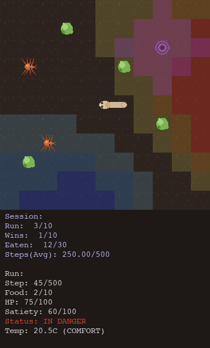

# Visualisation

`run_simulation.py --theme <name>` selects how a session is rendered. Two Pygame renderers draw the world with sprites inspired by real *C. elegans* ecology; the terminal themes draw it as text; `headless` skips rendering entirely and is the right choice for batch training and CI.

| Theme | Substrate | Notes |
|---|---|---|
| `pixel` (default) | grid | Pygame window; the only renderer that supports multi-agent runs |
| `pixel_continuous` | continuous-2D | Pygame fidelity renderer: full-arena plate view, concentration-field heatmaps, sensor overlays |
| `ascii`, `emoji`, `unicode`, `colored_ascii`, `rich`, `emoji_rich` | grid | Terminal rendering, single-agent only |
| `headless` | both | No rendering — fastest |

The Pygame themes need the `pixel` extra (`uv sync --extra pixel`). Two flags change what is drawn regardless of theme: `--show-last-frame-only` prints only each run's final frame in terminal themes, and `--manyworlds` (single run only) overlays the top two candidate actions at every step.

## Continuous-2D renderer


```bash
uv run ./scripts/run_simulation.py \
  --config configs/scenarios/foraging/mlpppo_small_continuous2d_fick_adaptive_klinotaxis.yml \
  --theme pixel_continuous --runs 50
```

The worm moves at sub-cell resolution on a plate view of the whole arena. The heatmap shows the selected concentration field; predator detection and damage radii are drawn as rings; the status bar adds the adaptive chemosensor's readout (`B` background, `r` response).

| Key | Action |
|---|---|
| `H` | Toggle the concentration-field heatmap |
| `F` | Cycle the heatmap field (food → predator → temperature → oxygen → pheromone) |
| `G` | Toggle the gradient quiver (up-gradient arrows; off by default) |
| `C` | Toggle the camera (full-arena plate ↔ agent-following zoom) |

## Grid renderer

### Single agent



### Multi-agent


Multi-agent sessions draw every agent in its own colour. The viewport follows one agent at a time.

| Key | Action |
|---|---|
| `←` `→` | Cycle between agents |
| `1`–`9` | Jump to an agent by number |
| `P` | Toggle the pheromone overlay (food = green, alarm = red, aggregation = blue) |

## Entities

| Entity | Visual | Biological basis |
|---|---|---|
| Nematode head | Translucent rounded head with pharynx bulb, facing its heading | *C. elegans* head morphology |
| Nematode body | Connected tan/cream segments with a tapered tail | *C. elegans* body colouring |
| Multi-agent colours | Eight-colour palette (cream, blue, green, red, orange, purple, cyan, yellow) | Visual differentiation for 2+ agents |
| Dead agent | Grey overlay with a red X | Agent terminated (starved, killed, frozen) |
| Food | Green clustered dots | *E. coli* OP50 bacterial lawns |
| Stationary predator | Purple ring/net structure with a toxic zone | Constricting-ring fungal traps (*Drechslerella*) |
| Pursuit predator | Orange-red mite; on the continuous substrate it scuttles, turns to face its heading and lunges on a strike | Predatory mites |

## Environment layers

| Layer | Description |
|---|---|
| Soil | Dark earth background with subtle texture |
| Temperature zones | Blue (cold) through neutral to red/orange (hot), following the thermal gradient |
| Oxygen zones | Red (hypoxia) through neutral to cyan (hyperoxia), following the O₂ concentration |
| Toxic zones | Purple overlay around stationary predators marking the damage radius |
| Pheromone overlay | Togglable overlay of pheromone concentration (green = food, red = alarm, blue = aggregation) |
| Concentration heatmap (continuous only) | Togglable heatmap of the selected field, with an optional gradient quiver |

## Status bar

Session-level information (run progress, cumulative wins, total food eaten, average steps) and run-level information (current step, food collected, health, satiety, danger status, temperature zone, oxygen zone). Multi-agent mode adds the followed-agent indicator, per-agent food counts and alive/dead status; the continuous renderer adds the adaptive-sensor readout and the current overlay toggles.

## Session summary

Whatever the theme, a summary is printed when all runs complete and the per-run and session-level CSVs and plots are written to `exports/<session-id>/` (see the [usage guide](usage.md#outputs)):

```text
Total runs completed: 50
Successful runs: 30 (60.0%)
Failed runs - Starved: 2 (4.0%)
Failed runs - Health Depleted: 15 (30.0%)
Failed runs - Max Steps: 3 (6.0%)
Average foods collected per run: 8.18
Average steps per run: 300.20
Average reward per run: 1.93
Average distance efficiency per run: 0.32
Average survival score: 0.72
Average temperature comfort: 0.68
Success rate: 60.00%
```

## Exporting frames

`scripts/export_screenshot.py` renders a frame of a session to an image for documentation; the hero animation in the README was produced this way from a continuous-2D session.
